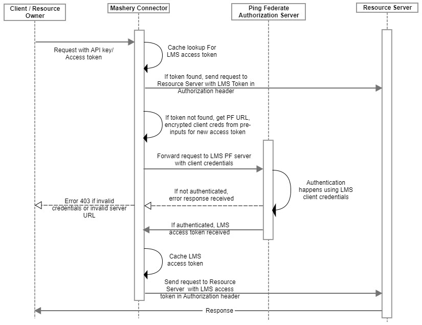

---
sidebar_position: 3
---

# Design and Implementation

<head>
  <meta name="guidename" content="API Management"/>
  <meta name="context" content="GUID-942a245d-b360-41ac-9930-6d75a0cf9fab"/>
</head>

## Sequence Diagram

## Implementation Details

Getting LMS Ping Federate authentication related configuration from pre-input. 

Enable Last Mile Security (new preInput parameter: enable\_lms\_pf\_token\_auth) 

1. The connector first looks for the LMS access token in cache (key: LMS\_Token\_EndPointkey). 

1. If the token is found in cache, the connector checks if the Ping Federate server URL and encrypted client credentials string is unchanged. If both these values match, the cached LMS access token is added as Authorization header in the target request and request is forwarded to resource server. 

1. If any of these values do not match or if the token is not found in cache, the connector gets a new token from the Ping Federate server.

   - The connector fetches the Ping Federate server URL from lms\_pf\_base\_url and client credentials from lms\_pf\_oauth\_client which is Base64 encoded (client\_id:client\_secret) from pre-input configuration.

1. The connector sends a request to the Ping Federate server for fetching access token by adding the Base64 encoded auth string as a Basic Authentication header to this request. 

1. The Ping Federate Auth server response contains the access token which is cached for 10 seconds less than expires\_in time for use in subsequent calls. (key: LMS\_Token\_EndPointkey) 

1. The LMS access token is then added as Authorization header in the target request and the request is forwarded to resource server. 

1. The connector will not retry sending request again to the Ping Federate server in case token fetching fails. 

:::note

LMS comes in effect only after successful authentication of API call in the frontend. 

:::
