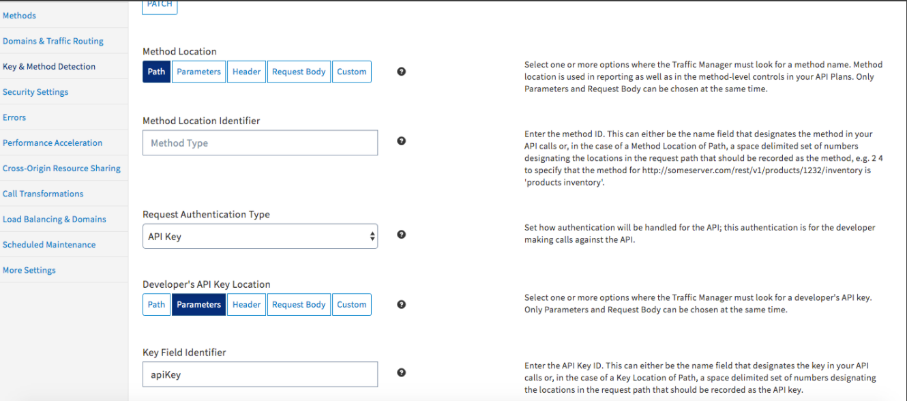
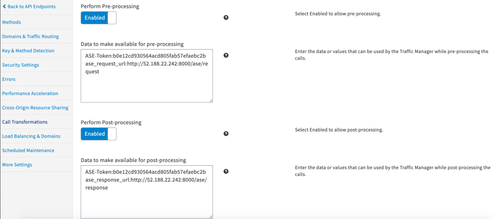

---
sidebar_position: 4
---

# Configuring Endpoint Call Processing

<head>
  <meta name="guidename" content="API Management"/>
  <meta name="context" content="GUID-15919aac-b2f7-4c3e-bd55-97bc50157a5b"/>
</head>

Following sample example shows, how to configure an endpoint that meets following requirements. 



**Authentication** 

- Request Authentication Type: API Key 

- Developer's API Key Location: Parameters 

- Key Field Identifier: `<field name to identify api key>`

:::note

These settings should be done under **Key & Method Detection** section as shown in above screenshot. 

:::



**On the Call Transformations page, specify the following information in these fields:** 

- Processing adapter: com.mashery.proxy.customer.generic.ping-intelligence-connector 

- Perform Pre-processing: Yes 

- Data to make available for pre-processing (one per line) 

  |**Data** |**Example** |**Notes** |
  | ---- | ---- | --- |
  |`ASE-Token: <ASE Token value>` |ASE-Token:e92c57343fe94c1bbd1f626cb6123809 |Mandatory; String value. ASE Token for authenticating ASE request. Must be already generated at Ping Intelligence ASE and shared with API Management|
  |`ase_request_url:<string>` |`ase_request_url:http://122.15.206.157:8000/ase/request` |Mandatory; String value. URL of the **primary** ASE request endpoint. |
  |`ase_secondary_url:<string>` |`ase_secondary_url: https://52.188.22.242:8112/ase/request,https://52.188.22.242:8443/ase/request` |Optional; String value. A comma-separated list of **secondary** ASE request URLs. If `are_request_url` is loaded then API Management sends a request to this URL. |
  |`ase_socket_timeout:<integer>` |`ase_socket_timeout:600` |Optional; Integer value. The timeout in a millisecond, after which the connector will retry sending the request to the ASE. Valid value range: 100 - 600. Default value: 500 |
  |`JKS_NAME:<string>` |`JKS_NAME:tml-tm-trust` |Optional; String value. Name of the trust store file, having imported the self-signed or CA certified ASE TLS/SSL certificate. This certificate should be provided by the customer and must be imported into the API Management trust store. The ASE's TLS/SSL certificate must be imported into the trust store present under the directory: `/etc/mashery-client-ssl/` |
  |`storepasskey:<string>` |`storepasskey:tibco/truststore_credentials` |<p>Optional; String value. Required parameter if ASE URL is HTTPS. Customer namespace matching the already provisioned parameter name in the AWS System Manager Parameter Store for specific customer. Storepasskey is the customer specific namespace for the key in AWS Parameter store corresponding to trust-store credential. </p><p>**Format:** `<customer>/truststore_credentials` </p>|
  |`enable_ase_url_caching:<boolean>` |`enable_ase_url_caching:true` |Optional; boolean value. Flag to enable caching the last working ASE URL. In case of `ase_request_url` is fully loaded and `ase_back_url` is processing the API Management requests and returning HTTP response. For all the subsequent HTTP requests, this last working ASE URL will be used by API Management. |
  |`ase_url_cache_ttl:<integer>` |`ase_url_cache_ttl:60` |Optional; Integer value. The cache timeout(in Second) if the flag: enable\_ase\_url\_caching is true. Valid value range: 1 - 300. Default value: 60 |
  |`suppress_headers_in_ase_request:<string>` |suppress\_headers\_in\_ase\_request:X-Forwarded-For,host |Optional; String. A comma-separated list of client headers which API Management should suppress while sending the API Management to ASE request with client metadata. |
  |`ase_max_retry_count:<integer>` |ase\_max\_retry\_count:2 |Optional; Integer value. The number of retry attempts connector should make after no response from ASE after configured ase\_socket\_timeout. After max retry attempts, the connector will send a request to another configured ASE if no response in any attempt. Valid value range: 1 - 3. Default value: 2 |

- **Perform Post-processing:** Yes 

- **Data to make available for post-processing** (one per line) 

  |**Data** |**Example** |**Notes** |
  | --- | ---- | ---- |
  |`ASE-Token: <ASE Token value>` |ASE-Token:e92c57343fe94c1bbd1f626cb6123809 |Mandatory; String value. ASE Token for authenticating ASE request. |
  |`ase_response_url:<string>` |`ase_response_url: http://122.15.206.157:8000/ase/re sponse` |Mandatory; String value. URL of the ASE response endpoint. |

## Interaction between API Management Gateway and Ping Intelligence ASE

This section provides reference sample calls. 

**User Client Request to API Management** 

```xml
curl -v -X 'GET' -H 'Host:cstest.api.ceml.mashspud.com' -H 'X-MasheryDebug:398c80380ad5cd32c06e8018108528a6119e33f99a639dfc965bb461392baf02' -H 'x-apikey: zhxuetuay9cy84mbngpx4smj' 'http://52.191.39.34/aj1886/Validate/Https/APIKeyInHeader'
```

**ASE Sideband Request API (Sample)**

- **Endpoint:** /ase/request 

- **Method:** POST 

- **Content-Length:** Length of the body 

- ASE-Token:9a70411eff944843bc1734ad6e52d55b (Created at ASE already) 

- X-CorrelationID:Id-7a076088-61b5-4b15-afa3-487c469e0c54 (Sample) 
- Body 

```xml
{
"source_ip": "10.240.0.6",
"source_port": 80,
"method": "GET",
"url": "/shopapi",
"http_version": "HTTP/1.1",
"headers": [
{
"host": "cstest.api.ceml.mashspud.com"
},
{
"x-forwarded-for": "10.240.0.6"
},
{
"x-api-key": "zhxuetuay9cy84mbngpx4smj"
},
{
"user-agent": "curl/7.64.1"
}
]
}
```

**ASE Sideband Response API (Sample)**

- Endpoint : /ase/response 

- Method: POST 

- Content-Length: Length of the body 

- ASE-Token: 9a70411eff944843bc1734ad6e52d55b 

- X-CorrelationID:Id-7a076088-61b5-4b15-afa3-487c469e0c54 

- Body: 

```xml
{
"response_code": 200,
"response_status": "OK",
"http_version": "HTTP/1.1",
"headers": [
{
"content-type": "application/xml"
},
{
"content-length": "442"
},
{
"content-type": "text/html; charset=UTF-8"
},
{
"Access-Control-Allow-Methods": "POST, GET, OPTIONS, DELETE"
}
]
}
```

## Persistent Connection between API Management and Ping Intelligence ASE

By default, HTTP/S connections close after each request. To make it persistent, API Management sends the Connection header with keep-alive value through the request to ASE. Enabling this allows API Management to send multiple requests over a single TCP connection to ASE. To enable API Management to ASE persistent connection, the ASE should be configured to honor the Connection:keep-alive request header sent by API Management. 

Compliance: https://tools.ietf.org/html/rfc7230#appendix-A.1.2

**Sample API Management to ASE POST Request with Client Metadata**

```
{User-Agent=Mashery, X-CorrelationID=Id-5219fdad-038f-4e0f-80b4-66beaf933748, Host=ASE, Content-Type=application/json;charset=utf-8, Content-Length=329, ASE-Token=873f7843ef9c4e7393fa05cf20a7061d, Connection=keep-alive}
```

```xml
{
"source_ip": "10.0.0.3",
"source_port": 80,
"method": "GET",
"url": "/mashery",
"http_version": "HTTP/1.1",
"headers": [{
"host": "chains.api.example.com"
}, {
"content-type": "application/json;charset=utf-8"
}, {
"content-length": "0"
}, {
"x-forwarded-for": "10.0.0.3"
}, {
"X-API-Key": "3aj4q6s7cv8a8547g56s6txf"
}, {
"user-agent": "curl/7.54.0"
}]
}
```

**ASE Response to verify persistent connection:**

```
HTTP/1.1 200 OK [Server: ASE, Connection: keep-alive, Content-Length: 180, Set-Cookie: PISESSIONID=Id-66580494-4ddc-4a4d-abcb-4c107302fecf; Max-Age=180]
```

**Sample API Management to ASE POST Request with Origin Server Response Metadata**

```
{X-CorrelationID=Id-ac731452-9c70-4532-9cb2-03489f3a1bc8, ASE-Token=873f7843ef9c4e7393fa05cf20a7061d, Connection=keep-alive}
```

```xml
{
"response_code": 200,
"response_status": "OK",
"headers": [{
"content-type": "application/json"
}, {
"content-length": "100"
}]
}
```

**ASE Response to verify persistent connection:**

```
HTTP/1.1 200 OK [Server: ASE, Connection: keep-alive, Content-Length: 128]
```

