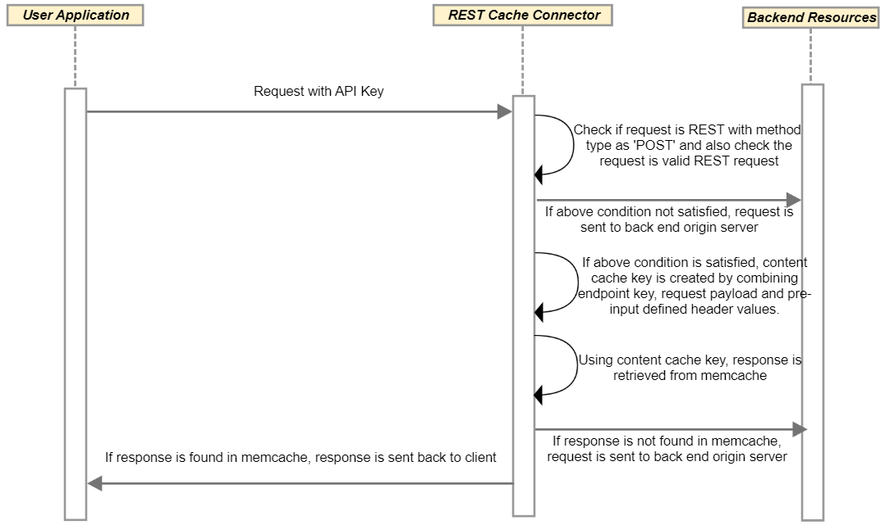

---
sidebar_position: 3
---

# Design and Implementation

<head>
  <meta name="guidename" content="API Management"/>
  <meta name="context" content="GUID-c1fb1d9d-c5f3-4988-8c76-5c2b533189d0"/>
</head>

This topic describes REST Cache Connector design and implementation. 

## Sequence Diagrams

**Pre-Process Sequence Diagram**

**Post-Process Sequence Diagram**

## Implementation Details

- The Connector checks whether the request method is POST and the request type is SOAP through a Content-Type request header and namespace present in the request payload. 

- If the validation in the previous bullet is unsuccessful, the request is not cached and is sent to the back-end target endpoint to fetch the response. 

- If the request Content-Type is either application/xml, text/xml, or application/soap+xml, and the request payload does not contain valid xml or if the request payload contains SOAP message, a 400 Bad Request error message response is returned to the client. 

- If the validation in the previous bullet is successful, then the cache key is created by generating an MD5 string that combines the endpoint key, the request payload, and the pre-input defined header values. 

- For the recently generated content cache key, the response is retrieved from the cache. 

- If there is a cached response, the response is returned to the client. 

**Post Process**

- The Connector checks whether the content cache key was created during the pre-process, if the request is valid for caching, and if the response status code is 200. 

- The Connector checks the Content-Type response header to see if the response payload is non-binary. 

- If the conditions described in the previous two bullets are satisfied, the cache\_ttl is retrieved from the pre-input. If the cache\_ttl is non-numeric, or its value is not between 0 and 60 minutes, then the cache expiry time is set to 5 minutes. 

- The response is cached against the content cache key created in the pre-process for the calculated cache expiry. 

- The response is returned to the client. 

## Business Rules Assumptions

- The request is cached only when the Content-Type header for both requests, and the response, are set correctly.

- XML or JSON message should be correctly formed. 

- Only non-binary responses are cached. 

- If the header specified in the pre-input configuration arrives multiple times in the request, multiple values are not used for creating the cache key.

## Content Cache Key Formation

The Content Cache Key formation must be an MD5 string that includes: 

- A unique service endpoint key (required) 

- POST body (payload) (required) 

- Pre-input configurable headers data (optional)