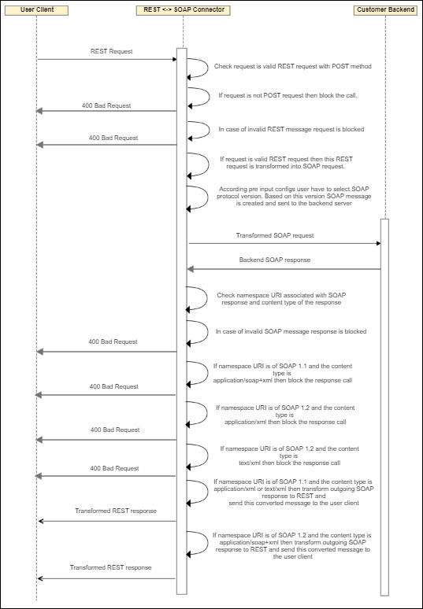

---
sidebar_position: 3
---

# Design and Implementation

<head>
  <meta name="guidename" content="API Management"/>
  <meta name="context" content="GUID-29bd9da1-82ce-4940-8a2c-e4a47ba75e03"/>
</head>

## Sequence Diagram

User Client --\>REST --\>Connector --\>SOAP --\>Origin Server 

Origin Server --\>SOAP --\>Connector --\>REST --\>User Client 

## Implementation Details

1. The connector checks incoming request is valid REST request with POST method. 

1. If request is not POST, then the connector blocks the incoming call and sends response with 400 as a bad request. 

1. if request is not valid REST request, then the connector blocks the incoming call and sends response with 400 as a bad request. 

1. if request is valid REST request, then the connector converts this request to the SOAP message. 

1. Users have to configure SOAP protocol version in pre inputs depending on this SOAP version, SOAP message is created and call gets forwarded to the backend. 

1. Default SOAP protocol version is 1.1 

1. In post processing, the connector fetches namespaceURI associated with SOAP response and response content type. 

1. In post process, if namespaceURI is of SOAP 1.1 (for example, http://schemas.xmlsoap.org/soap/envelope) and content type is application/soap+xml, that means SOAP response version and content type is mismatching. The connector blocks the outgoing call and sends response with 400 as a bad request. 

1. If namespaceURI is of SOAP 1.2 (for example, http://www.w3.org/2003/05/soap-envelope) and content type is application/xml, that means SOAP response version and content type is mismatching. The connector blocks the outgoing call and sends response with 400 as a bad request. 

1. If namespaceURI is of SOAP 1.2 (for example, http://www.w3.org/2003/05/soap-envelope) and content type is text/xml, that means SOAP response version and content type is mismatching. The connector blocks the outgoing call and sends response with 400 as a bad request. 

1. If namespaceURI is of SOAP 1.1 (for example, http://schemas.xmlsoap.org/soap/envelope) and content type is application/xml, then the connector allows the response. The connector transforms outgoing SOAP response to REST and forwards response to the user client. 

1. If namespaceURI is of SOAP 1.2 (for example, http://www.w3.org/2003/05/soap-envelope) and content type is application/soap+xml, then the connector allows the response. The connector transforms SOAP response to REST and forwards response to the user client. 

1. The connector conforms SOAP 1.1 should have content type as application/xml or text/xml. SOAP 1.2 supports application/soap+xml content type. 

1. The connector conforms the combinations of content type and namespaceURI as per the point 7, 8 and 9. 
1. For more details on SOAP message content type = application/soap+xml, refer to https://tools.ietf.org/html/rfc3902. 

1. For more details on content type = application/xml, refer to https://tools.ietf.org/html/rfc3023. 

## Business Rules and Assumptions

- While sending the REST request, make sure REST request should be valid REST message otherwise connector blocks the incoming call and send response with 400 as a bad request.

- Supports RESTful POST messages only. 

- In outgoing SOAP response, make sure namespaceURI in request conforms to SOAP protocol version.

- SOAP 1.1 expects content type to be either application/xml or text/xml, while SOAP 1.2 expects content type to be application/soap+xml.

- The connector supports overriding default Connector error messages with API Management Control Center configured custom error messages using an optional flag 'override\_custom\_error\_message'.

## Error Messages

|**Error Name** |**HTTP Status Code** |**Cause** |
| ---- | ----- | ---- |
|RequestShouldNotBeEmpty |400 |Request body is empty. |
|ErrorInTransformationOfRestToSoap |400 |Can not create SOAP request from REST. |
|InvalidRequest |400 |Request can not be proceed as request method is not POST or Content type is missing in request or request is not a REST request. |
|SoapVersionAndContentTypeNotMatching |400 |SOAP message version and content type is not matching. |
|ErrorConvertingSoapToRest |400 |Can not convert SOAP response to REST. |
|InvalidSoapResponse |400 |SOAP response is not valid. |
|InvalidContentTypeForSoap |400 |Invalid Content Type for SOAP response. |
|UnsupportedEncodingException |400 |Unable to create payload input stream object. |
|InvalidParserConfiguration |400 |Invalid Parser Configuration. |
|UnableToReadNamespaceURIFromSoapMessage |400 |Unable to read Namespace URI from SOAP response. |
|InvalidJsonRequest |400 |Unable to generate SOAP request as JSON is invalid. |
|ErrorWhileClosingInputStreamObject |400 |Error while closing object when creating SOAP body from REST. |
|InvalidXML |400 |Input Request XML Error. |
|ErrorWhileCreatingSoapMessage |400 |Error while adding raw xml in SOAP body. |
|RequestPayloadReadError |400 |Error in request payload. |

