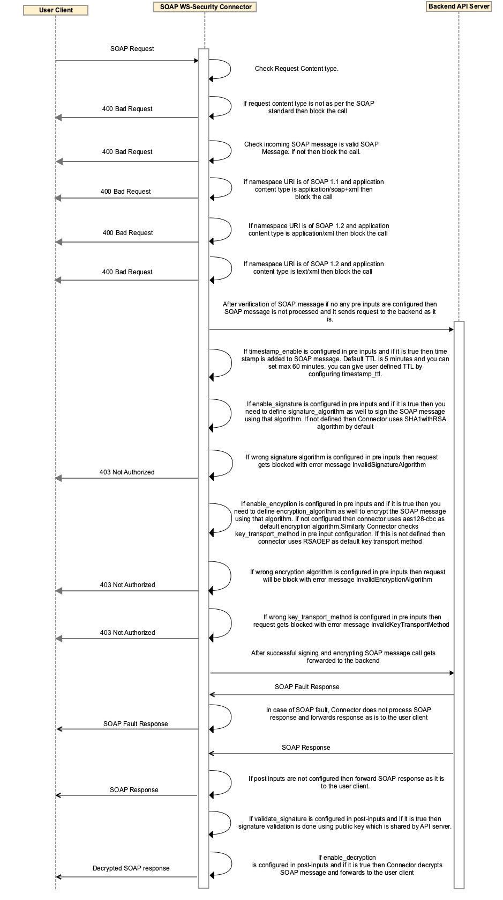

---
sidebar_position: 3
---

# Design and Implementation

<head>
  <meta name="guidename" content="API Management"/>
  <meta name="context" content="GUID-e5ae4a9b-63f0-45b0-b524-acb97e6ba4f8"/>
</head>

## Sequence Flow Diagram



## Implementation Details

1.  Connector fetches namespaceURI associated with SOAP request, and request content type.

2.  In pre-process, If namespaceURI is of SOAP 1.1 (e.g. http://schemas.xmlsoap.org/soap/envelope), and content type is **application/soap+xml**; that means SOAP request version, and content type is mismatching. Connector blocks the incoming call, and sends a response with 400 as a bad request.

3.  If namespaceURI is of SOAP 1.2 (e.g. http://www.w3.org/2003/05/soap-envelope), and content type is **application/xml**, that means SOAP request version and content type is mismatching. Connector blocks the incoming call, and sends a response with 400 as a bad request.

4.  If namespaceURI is of SOAP 1.2 (e.g. http://www.w3.org/2003/05/soap-envelope), and content type is **text/xml**, that means SOAP request version and content type is mismatching. Connector blocks the incoming call, and sends a response with 400 as a bad request.

5.  If namespaceURI is of SOAP 1.1 i.e. http://schemas.xmlsoap.org/soap/envelope and content type is **application/xml**, or **text/xml** then connector allows the call.

6.  If namespaceURI is of SOAP 1.2 i.e. http://www.w3.org/2003/05/soap-envelope, and content type is application/soap+xml, then connector allows the call.

7.  If no pre input is configured, then Connector simply forwards request to the backend as it is.

8.  If **timestamp_enable** is configured in pre inputs, and if it is true, then time stamp is added to SOAP message. Default TTL is 5 minutes but you can set maximum of 60 minutes TTL by configuring **timestamp_ttl.**

9.  If **enable_signature** is configured in pre inputs, and if it is true, then we need to define **signature_algorithm** to sign the SOAP request using configured algorithm.

10. if **wrong signature_algorithm** is configured in pre inputs, then request gets blocked with error message InvalidSignatureAlgorithm.

11. if **enable_encryption** is configured in pre inputs, and if it is true, then we need to define **encryption_algorithm** to encrypt the SOAP message using configured algorithm.

12. If wrong **encryption_algorithm** is configured in pre inputs, then request gets blocked with error message InvalidEncryptionAlgorithm.

13. For more details on Encryption Algorithms, please check [https://www.w3.org/TR/xmlenc-core1/#sec-Algorithms](https://www.w3.org/TR/xmlenc-core1/#sec-Algorithms).

14. There is an option to configure the **key transport method** using key\_transport\_method pre input configuration.
15. For more details on Key Transport Algorithms, please check [https://www.w3.org/TR/xmlenc-core1/#sec-Alg-KeyTransport](https://www.w3.org/TR/xmlenc-core1/#sec-Alg-KeyTransport).

16. After successfully signing, and encrypting SOAP message; Connector forwards request to the backend server.
17. In post processing Connector confirms that SOAP 1.1 should have content type as **application/xml** or **text/xml** whereas SOAP 1.2 should have **application/soap+xml** content type.

18. Connector confirms the combinations of content type and namespaceURI as per the point 2,3, and 4.

19. If in response connector receives SOAP fault, then connector can't process the response, and it simply forwards SOAP response as is to the user client.

20. If **validate_signature** is configured in post processing, and if it is true, then SOAP response signature gets validated.

21. If **enable_decryption** is configured in post processing, and if it is true, then encrypted SOAP response gets decrypted.

22. After signature validation, and successful decryption; Connector forwards SOAP response to the user client.
23. More details on SOAP message content type = application/soap+xml please check [https://tools.ietf.org/html/rfc3902](https://tools.ietf.org/html/rfc3902).

24. For content type = application/xml please check [https://tools.ietf.org/html/rfc3023](https://tools.ietf.org/html/rfc3023).

## SOAP Encryption Flow

**SOAP Encryption can be done in two steps:**

The first step is to perform a symmetric encryption on the specified message element with a secret key.

* Connector picked up the soapenv:Body element content by default as the input for message encryption.

* If encryption algorithm is configured in pre input then connector uses this algorithm for encryption or if not configured then connector picks http://www.w3.org/2001/04/xmlenc#aes128-cbc i.e. aes128-cbc by default as the algorithm for message encryption.

* Connector encrypts soapenv:Body element and content will be replace with xenc:EncryptedDataThe Base64 encoded string of the encryption output was then included in the xenc:EncryptedData/xenc:CipherData/xenc:CipherValue sub element.
    
    The second step is to perform RSA encryption on the secret key with SOAP message receiver's public key.
    
    * If Key transport method algorithm is configured, then connector uses this algorithm for encrypting the secret key. If not configured then connector uses defaultkey transport method as RSAOEPhttp://www.w3.org/2001/04/xmlenc#rsa-oaep-mgf1p the algorithm for encrypting the secret key, see value of wsse:Security/xenc:EncryptedKey/xenc:EncryptionMethod\[@Algorithm\]Connector uses RSA keystore file to picked up the public key for encrypting the secret key.

    * The Base64 encoded string of the encrypted secret key was included in the wsse:Security/xenc:EncryptedKey/xenc:CipherData/xenc:CipherValueSOAP Message receiver have to use private key from its own certificate database in order to decrypt the secret key.

## SOAP Decryption Flow

**SOAP Decryption can be done in two steps:**

The first step is to decrypt the secret key with the receiver's private key:

* Parse out the content of xenc:EncryptedKey/xenc:CipherData/xenc:CipherData/xenc:CipherValue element into a string: encryptedKeyString.

* Decode the Base64 string, encryptedKeyString, to a byte sequence: encryptedKeyBytes.

* Determine the encryption algorithm by looking at the xenc:EncryptedKey/xenc:EncryptionMethod\[@Algorithm\] attribute value i.e. http://www.w3.org/2001/04/xmlenc#rsa-oaep-mgf1p.
    
* Decrypt encryptedKeyBytes with the private key using the rsa-oaep-mgf1p algorithm and save the result into a byte sequence, keyBytes, which represents the secret key.

The next step is to decrypt the SOAP message using the secret key obtained from the previous step:

* Parse out the content of xenc:EncryptedData/xenc:CipherData/xenc:CipherValueelement into a string: encryptedMsgString.
* Decode the Base64 string, encryptedMsgString, to a byte sequence: encryptedMsgBytes.
* Decrypt encryptedMsgBytes with the secret key and save the result into a byte sequence, msgBytes
* Replace xenc:EncryptedDataelement with msgBytes. The resulting soapenv:Bodyelement should have the decrypted content now.

## Supported Signature and Encryption Algorithm Matrix
  
| Signature Algorithm |     |     | Encryption Algorithm |     |
| --- | --- | --- | --- | --- |
| **RSA** | **DSA** | **ECDSA** | **Key Transport Method for Encryption** | **Encryption Methods** |
| --- | --- | --- | --- | --- |
| SHA1withRSA<br/><br/>SHA224withRSA<br/><br/>SHA256withRSA<br/><br/>SHA384withRSA<br/><br/>SHA512withRSA | SHA1withDSA<br/><br/>SHA256withDSA | SHA1withECDSA<br/><br/>SHA224withECDSA<br/><br/>SHA256withECDSA<br/><br/>SHA384withECDSA<br/><br/>SHA512withECDSA | [http://www.w3.org/2001/04/xmlenc#rsa-1_5](http://www.w3.org/2001/04/xmlenc#rsa-1_5)<br/><br/>[http://www.w3.org/2001/04/xmlenc#rsa-oaep-mgf1p](http://www.w3.org/2001/04/xmlenc#rsa-oaep-mgf1p) | [http://www.w3.org/2001/04/xmlenc#tripledes-cbc](http://www.w3.org/2001/04/xmlenc#tripledes-cbc)<br/><br/>[http://www.w3.org/2001/04/xmlenc#aes128-cbc](http://www.w3.org/2001/04/xmlenc#aes128-cbc)<br/><br/>[http://www.w3.org/2009/xmlenc11#aes128-gcm](http://www.w3.org/2009/xmlenc11#aes128-gcm)<br/><br/>[http://www.w3.org/2001/04/xmlenc#aes192-cbc](http://www.w3.org/2001/04/xmlenc#aes192-cbc)<br/><br/>[http://www.w3.org/2009/xmlenc11#aes192-gcm](http://www.w3.org/2009/xmlenc11#aes192-gcm)<br/><br/>[http://www.w3.org/2001/04/xmlenc#aes256-cbc](http://www.w3.org/2001/04/xmlenc#aes256-cbc)<br/><br/>[http://www.w3.org/2009/xmlenc11#aes256-gcm](http://www.w3.org/2009/xmlenc11#aes256-gcm) |

## Business Rule Assumptions

While sending the SOAP request, make sure SOAP request should be valid SOAP message otherwise connector blocks the incoming call and send response with 400 as a bad request.

While sending the SOAP request, make sure namespaceURI in request conforms to SOAP protocol version.

SOAP 1.1 expects content type to be either **application/xml** or **text/xml** while SOAP 1.2 expects content type to be **application/soap+xml**.

If **enable_signature** is configured as true but **signature_algorithm** is not configured then connector uses Rivest-Shamir-Adleman algorithm with Secure Hash Algorithm 1 **(SHA1withRSA)** as default signature algorithm.

If **enable_encryption** is configured as true but **encryption_algorithm** not configured then connector uses Advanced Encryption Standard (AES) algorithm with a key length of 128 bits (http://www.w3.org/2001/04/xmlenc#aes128-cbc) **aes128-cbc** as default encryption algorithm.

If **key\_transport\_method** is not configured then then connector uses default key transport method as **RSAOEP** (http://www.w3.org/2001/04/xmlenc#rsa-oaep-mgf1p).

Pre input parameter **override\_custom\_error_message** supports flexibility to either use Connector specific error set or use Control Center configured custom error set. Default value for this parameter is false.

If SOAP request data is too large to handle (~100 MB), processing fails with HTTP/1.1 400 Bad Request and Response as **UnableToReadNamespaceURIFromSoap**.

If SOAP request data contains 2 elements in Body part, processing fails with HTTP/1.1 403 Not Authorized and Debug Header as Only one body allowed for SOAP 1.2 RPC. and response as **ErrorWhileProcessingSoapEnvelope**.

If connector gives error response like ErrorInRsaSoapSignature, **ErrorInDsaSoapSignature, ErrorInEcdsaSoapSignature** or **ErrorWhileEncryptingSoapMessage** and there is debug header like **Error while signing SOAP message using &lt;algorithm name&gt;: null cannot create instance**. This means It might possible that JKS files are not available or JKS credentials are mismatching.

If connector gives error response like **ErrorWhileEncryptingSoapMessage** and there is debug header like **Error while encrypting SOAP message: null cannot create instance**. This means it might possible that SHA1withRSA JKS file is not available or JKS credentials are mismatching.

## Error Messages

| Error Name | HTTP Status Code | Cause |
| --- | --- | --- |
| RequestShouldNotBeEmpty | 400 | Request body is empty |
| RequiredContentTypeNotFound | 400 | Request content type is not matching with SOAP message |
| InvalidNameSpaceURI | 400 | Invalid Namespace URI in request SOAP message |
| InvalidSoapMessage | 400 | Invalid SOAP request |
| NamespaceURIMissingInSoapMessage | 400 | Namespace URI is missing in SOAP request |
| UnableToReadNamespaceURIFromSoapMessage | 400 | Error while reading Namespace URI from SOAP request |
| SoapVersionAndContentTypeNotMatching | 400 | SOAP message version and content type not matching |
| ErrorWhileProcessingSoapSecurityHeader | 403 | Error while adding security header in SOAP message |
| ErrorWhileProcessingSoapEnvelope | 403 | Error in SOAP envelope |
| ErrorWhileProcessingSoapRequest | 403 | Error in SOAP message document object |
| InvalidSignatureAlgorithm | 403 | Invalid signature algorithm |
| ErrorInRsaSoapSignature | 403 | * Error while signing SOAP message using RSA algorithm.<br/>* Or check JKS files present for selected RSA signature algorithm.<br/>* Or JKS credentials are mismatching. |
| ErrorInDsaSoapSignature | 403 | * Error while signing SOAP message using DSA algorithm.<br/>* Or check JKS files present for selected DSA signature algorithm.<br/>* Or JKS credentials are mismatching. |
| ErrorInEcdsaSoapSignature | 403 | * Error while signing SOAP message using ECDSA algorithm.<br/>* Or check JKS files present for selected ECDSA signature algorithm.<br/>* Or JKS credentials are mismatching. |
| InvalidEncryptionAlgorithm | 403 | Invalid encryption algorithm. |
| EncryptedKeyDoesNotContainCipherValue | 403 | EncryptedKey does not contain xenc:CipherData/xenc:CipherValue in encrypted SOAP response. |
| EncryptedKeyDoesNotContainEncryptionAlgorithm | 403 | xenc:EncryptedKey does not contain xenc:EncryptionMethod/@Algorithm in encrypted SOAP response. |
| ErrorWhileEncryptingSoapMessage | 403 | * Error while encrypting SOAP message.<br/>* Or check JKS files present for SHA1withRSA algorithm.<br/>* Or JKS credentials are mismatching. |
| SignatureVerificationFailed | 403 | SOAP response signature verification failed. |
| UnsupportedAlgorithm | 403 | An unsupported signature or encryption algorithm was used. |
| InvalidSecurity | 403 | An error was discovered processing the &lt;wsse:Security&gt; header. |
| FailedAuthentication | 403 | The security token could not be authenticated or authorized. |
| FailedCheck | 403 | The signature or decryption was invalid. |
| MessageExpired | 403 | The message has expired. |
| ErrorWhileRetrievingAWSParameter | 403 | Error while retrieving JKS credentials from AWS parameters. |

## SOAP Fault

The SOAP **&lt;Fault&gt;** element is used to transmit error and status information within a SOAP message.

The &lt;Fault&gt; element is the child of the body element and there can be only one &lt;Fault&gt; element in the body of a SOAP message.

**SOAP 1.1 &lt;Fault&gt; Element Contents**

Sub elements of the SOAP **&lt;Fault&gt;** element.
  
| Sub Elements | Description |
| --- | --- |
| faultcode | Standard code that provides more information about the fault. A set of code values is predefined by the SOAP specification, as defined below. This set of fault code values can be extended by the application.<br/><br/>Predefined fault code values include:<br/><br/>* VersionMismatch—Invalid namespace defined in SOAP envelope element. The SOAP envelope must conform to the http://schemas.xmlsoap.org/soap/envelope namespace.<br/>* MustUnderstand—SOAP header entry not understood by processing party.<br/>* Client—Message was incorrectly formatted or is missing information.<br/>* Server—Problem with the server that prevented message from being processed. |
| faultstring | Human-readable description of fault. |
| faultactor | URI associated with the actor (SOAP node) that caused the fault. In RPC-style messaging, the actor is the URI of the Web service. |
| detail | Application-specific information, such as the exception that was thrown. This element can be an XML structure or plain text. |

## SOAP 1.1 Fault Message

```xml
<?xml version="1.0" encoding="UTF-8"?>
<soap:Envelope xmlns:soap="http://schemas.xmlsoap.org/soap/envelope/">
   <soap:Body>
      <soap:Fault>
         <faultcode><soap:VersionMismatch></faultcode>
         <faultstring>Message was not SOAP 1.1 compliant</faultstring>
         <faultactor>http://sample.org.ocm/jws/authnticator</faultactor>
      </soap:Fault>
   </soap:Body>
</soap:Envelope>
```

**SOAP 1.2 &lt;Fault&gt; Element Contents**

Sub elements of the SOAP **&lt;Fault&gt;** element.

  
| Sub Elements | Description |
| --- | --- |
| env:Code | Information pertaining to the fault error code. The env:code consist of following two subelements:<br/><br/>env:Value<br/><br/>env:Subcode |
| env:Value | Code value that provides more information about the fault. A set of code values is predefined by the SOAP specification, including:<br/><br/>* VersionMismatch—Invalid namespace defined in SOAP envelope element. The SOAP envelope must conform to the http://schemas.xmlsoap.org/soap/envelope namespace.<br/>* MustUnderstand—SOAP header entry not understood by processing party.<br/>* Sender—Message was incorrectly formatted or is missing information.<br/>* Receiver—Problem with the server that prevented the message from being processed.<br/>* DataEncodingUnknown—Received message has an unrecognized encoding style value. You can define encoding styles for SOAP header blocks and child elements of the SOAP body, and this encoding style must be recognized by the Web services server. |
| env:Subcode | Subcode value that provides more information about the fault. This subelement can have a recursive structure. |
| env:Reason | Human-readable description of fault.<br/><br/>The &lt;env:Reason&gt; element contains one or more &lt;Text&gt; elements, each of which contains information about the fault in a different language. |
| env:Node | Information regarding the actor (SOAP node) that caused the fault. |
| env:Role | Role being performed by actor at the time of the fault. |
| env:Detail | Application-specific information, such as the exception that was thrown. |

## SOAP 1.2 Fault Message

```xml
<?xml version="1.0" encoding="UTF-8"?>
<env:Envelope xmlns:env="http://www.w3.org/2003/05/soap-envelope" xmlns:m="http://www.example.org/timeouts">
   <env:Body>
      <env:Fault>
         <env:Code>
            <env:Value>env:Sender</env:Value>
            <env:Subcode>
               <env:Value>m:MessageTimeout</env:Value>
            </env:Subcode>
         </env:Code>
         <env:Reason>
            <env:Text xml:lang="en">Sender Timeout</env:Text>
         </env:Reason>
         <env:Detail>
            <m:MaxTime>P5M</m:MaxTime>
         </env:Detail>
      </env:Fault>
   </env:Body>
</env:Envelope>
```