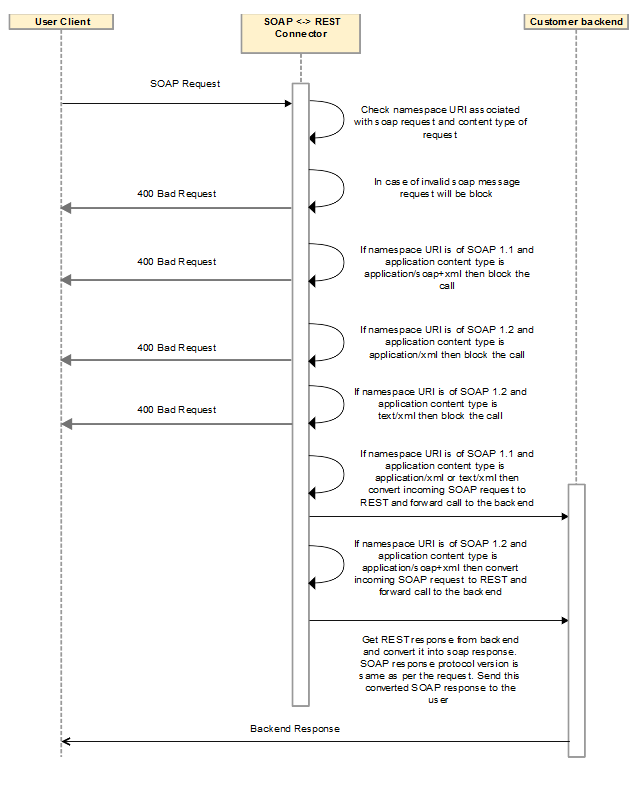

---
sidebar_position: 3
---

# Design and Implementation

<head>
  <meta name="guidename" content="API Management"/>
  <meta name="context" content="GUID-735b6324-2cdb-431a-8d06-4caee1c1578a"/>
</head>

## Sequence Diagram

## Implementation Details

- The connector fetches the namespaceURI associated with the SOAP request and request content type.

- In pre-process, if the namespaceURI is SOAP 1.1 (for example, http://schemas.xmlsoap.org/soap/envelope), and content type is application/soap+xml, the SOAP request version and content type are mismatched. The connector blocks the incoming call and sends the response with 400 as a bad request. 

- If the namespaceURI is SOAP 1.2 (for example, http://www.w3.org/2003/05/soap-envelope), and content type is application/xml, the SOAP request version and content type are mismatched. The connector blocks the incoming call and sends the response with 400 as a bad request. 

- If the namespaceURI is SOAP 1.2 (for example, http://www.w3.org/2003/05/soap-envelope), and content type is text/xml, the SOAP request version and content type are mismatched. The connector blocks the incoming call and sends the response with 400 as a bad request. 

- If the namespaceURI is SOAP 1.1 (for example, http://schemas.xmlsoap.org/soap/envelope), and content type is application/xml or text/xml, the connector allows the call. The connector transforms incoming SOAP requests to REST and thecall gets forwarded to the backend. 

- If the namespaceURI is SOAP 1.2 (for example, http://www.w3.org/2003/05/soap-envelope), and content type is application/soap+xml, the the connector allows the call. The connector transforms the SOAP request to REST and the call gets forwarded to the backend.

- In post-processing, the connector transforms the JSON response from the backend to the SOAP response and forwards the response to the user client. 

- In post-processing, the SOAP response message gets created as per the version of the SOAP request, which the connector transformed in pre-process. If in pre-process the connector gets a SOAP 1.1 request, in post-processing the connector creates a SOAP 1.1 message from the REST backend response.

- The connector conforms to SOAP 1.1, and should have a content type of application/xml or text/xml. SOAP 1.2 supports application/soap+xml content type. 

- The connector conforms to combinations of content type and namespaceURI as per points 2, 3, and 4 above. 
- For more details about SOAP message content type = application/soap+xml, see https://tools.ietf.org/html/rfc3902. 

- For content type = application/xml, see https://tools.ietf.org/html/rfc3023. 

## Business Rule Assumptions

- While sending the SOAP request, make sure the SOAP request is a valid SOAP message, otherwise the connector blocks the incoming call and sends the response with 400 as a bad request. 

- While sending the SOAP request, make sure namespaceURI in the request conforms to the SOAP protocol version. 

- SOAP 1.1 expects content type to be either application/xml or text/xml, while SOAP 1.2 expects content type to be application/soap+xml. 
