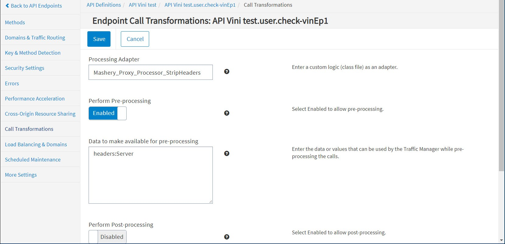

# Strip Headers Connector

<head>
  <meta name="guidename" content="API Management"/>
  <meta name="context" content="GUID-147eb40c-c41d-45b1-b5c9-4ce4ed042c40"/>
</head>

## Description

- The Strip Headers connector strips permissible HTTP headers in the backend target service API request/response. 
- API Management needs to cast/strip sensitive info in HTTP header either reaching to target backend server or from backend response. 

## Usage

- Sample configuration 

  `headers:Server`

- Before without Connector, response will contain backend server detail 

  `< Server: Jetty(8.1.3.v20120522)`

- After applying Connector, backend response will appear as follows.

  `< Server: Mashery Proxy>`

## Design and Implementation

:::note

- RFC does not allow stripping original HTTP header fields like Server. For more information, see https://www.w3.org/TR/ct-guidelines/#sec-altering-header-values. 

- In cases where Header cannot be removed, the value of the header gets masked with Mashery Proxy. 

:::

**Implementation Details**

- While pre-processing the request, the Connector retrieves the configured headers in preInput and searches for the configured headers within the target request. If the header is found, the Connector removes that header (key, value pair) from the target request. 

- While post-processing the response, the Connector retrieves the configured headers in postInput and searches for the configured headers within the target response. If the header is found then Connector removes that header (key, value pair) from the target response. 

## Configuring Endpoint Processing

To configure Strip Header call processing for an endpoint: 

1. From the API Management Control Center dashboard, navigate to Design > API Definitions, then click the desired API definition from the list. 

1. Click an existing endpoint on the Endpoints page. 

1. Click Call Transformations in the left-hand menu. 

1. On the Call Transformations page, specify the following information in these fields: 

   1. Processing Adapter: Mashery\_Proxy\_Processor\_StripHeaders

   1. Perform Pre-Processing: Enabled 

   1. Data to make available for pre-processing: `headers:<comma separated headers field>`

      Example: 

      `headers:Server`

1. Click Save when done.

## Chaining

The Strip Headers connector can be chained with other Boomi Cloud API Management connectors, as well as Boomi Cloud API Management adapters developed as processors. 

For more information on chaining two processors, see [Chaining Processors](../ChainingProcessorsorConnectors/Overview.md). 

## Local Edition Porting

The Strip Headers connector can be ported to Local Edition customer specific bundle. 

:::note

Porting of this Connector can be performed by API Management for a specific Local Edition customer. Consult the API Management Customer Success team for more information. 

:::

