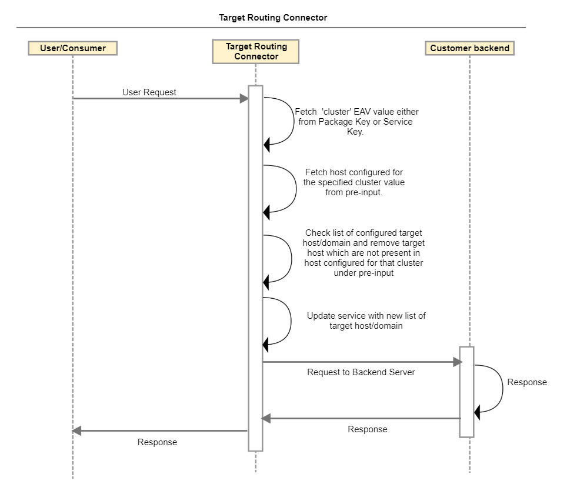
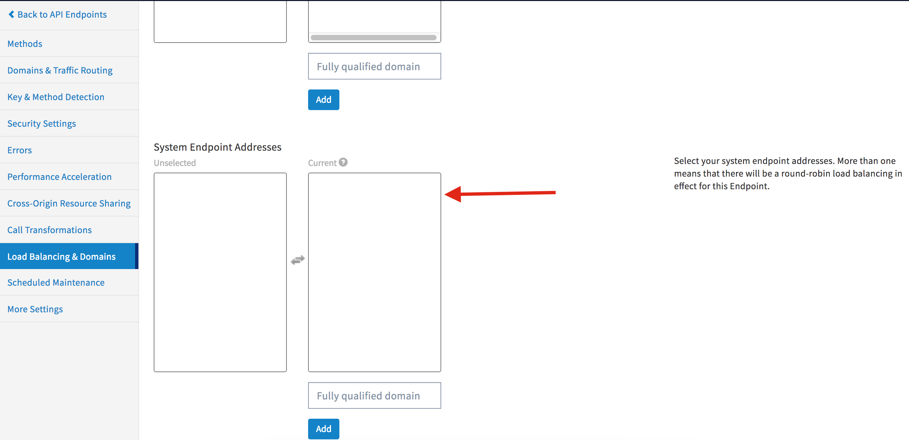
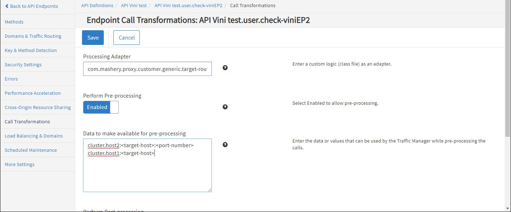

---
sidebar_position: 7
---

# Target Routing Connector

<head>
  <meta name="guidename" content="API Management"/>
  <meta name="context" content="GUID-c92ff5d6-b1ad-49b9-bc1c-2f540fd9d244"/>
</head>

## Description

The connector allows you to override the configured target host name in the service endpoint in order to forward request to the pre-inputs configured for the target host/domain for Package/Service Key. The connector Supports both Package and Service key level EAV (custom attributes). Using the list of configured target host/domain in the Load Balancing & Domains tab, it overrides all domains/target other than the configured cluster's target host defined in EAV. 

## Usage

Examples of the routing request according to the package/service key level EAV value and pre-input configurations are: 

- Create key level EAV with name cluster. 

- Enter the value in 'cluster' EAV created in the step above. For example: host1 

- Refer to the EAV.value in the pre-inputs of the Call transformation tab to set the target/domain route. For example: `cluster.host1:<target-host>`

- The request is forwarded to the `<target-host>` configured in pre-input configurations instead of the host configured under the **Load Balancing & Domains** tab. 

## Design and Implementation

**Sequence Diagram**

**Implementation Details**

- The 'cluster' EAV value (configured under either Package Key or Service Key) is fetched when the request is pre-processed. 

- Fetch the host configured for the specified cluster value from the pre-input. Example: 'cluster' EAV value is defined as 'host1' under Service key. From the pre-input fetch the value specified for 'cluster.host1'. Pre-input will be specified in the following format: c`luster.host1=<target-host>:<Port-Number>`

- Fetch list of configured target host/domain for the API service. This list is specified under the **Load Balancing & Domain** tab in the API Service definition. 

- The connector checks the list of the configured hosts/domains. If this list contains a host that is not specified for the cluster in the pre-input, then that host is removed from the list. 

- The service is updated with the new list of target hosts/domains and the request is sent to the backend server. 

## Configuring Endpoint Call Processing

To configure Target router call processing for an endpoint: 

1. From the API Management Control Center dashboard, navigate to Design > API Definitions, then click the desired API definition from the list. 

1. Click an existing endpoint on the Endpoints page. 

1. Click Call Transformations in the left-hand menu. 

1. On the Call Transformations page, specify the following information in these fields: 

   1. Processing Adapter: com.mashery.proxy.customer.generic.target-route-processor

   1. Perform Pre-Processing: Enabled 

   1. Data to make available for pre-processing: (one per line) 

      |**Data** |**Example** |**Notes** |
      | ---- | ---- | ---- |
      |`cluster.host2:<target-host>:<port-number>`| |Optional |
      |`cluster.host1:<target-host>`| |Optional |

      All `<target-host>` values need to be enabled on the Load Balancing & Domains > System Endpoint Addresses field. 

1. Click Save when done. 

## Chaining

Target Routing Connector can be chained with other Boomi Cloud API Management connectors, as well as Boomi Cloud API Management adapters developed as processors. 

For more information on chaining two processors, see [Chaining Processors](../ChainingProcessorsorConnectors/Overview.md). 

## Local Edition Porting

Target Routing Connector can be ported to Local Edition customer specific bundle. 
