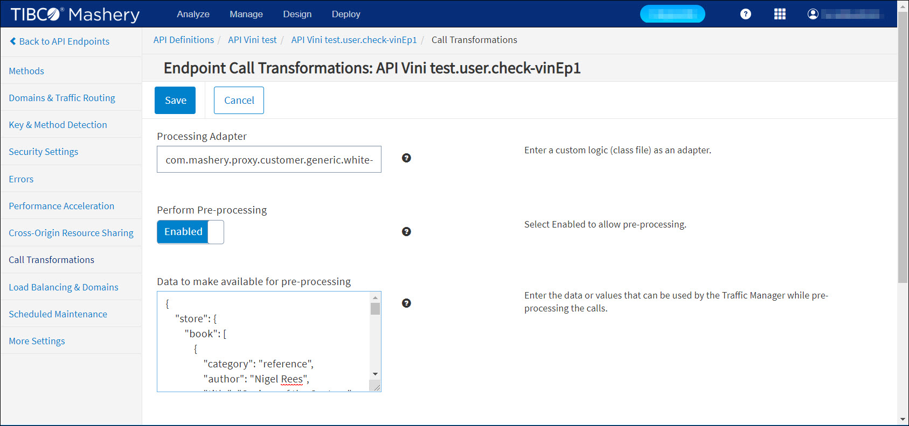

---
sidebar_position: 17
---

# Whitelisting Connector

<head>
  <meta name="guidename" content="API Management"/>
  <meta name="context" content="GUID-61fa4830-5726-405f-ae72-0b6e43d14e66"/>
</head>


## Description

The connector provides the ability to whitelist the incoming requests and determines whether the requests should be allowed based on defined business rules. The business rules check whether the values of the query, header or JSON body parameters match the configured pre-inputs in API Management Control Center. If a value match is found then the request is allowed. The connector only supports pre-processing of the API request. 

## Usage

The following matrix describes the HTTP Header Authentication behavior based on how the input is configured. 

|**Scenario** |**Pre-Input Configuration** |**Request Headers in the API Call** |**Expected Output** |
| ---- | --- | ---- | --- |
|Empty Pre-Input Configurations |`{}`|`{"RatePlan": "PQRST","UserCode": "abc1234"}`|Request is not blocked. |
|Single Header Matches With API Request Header |HeaderParams:`{"UserCode": "abc1234"}`|`{"RatePlan": "PQRST","UserCode": "abc1234"}`|Request is not blocked. |
|Header Not Present in the API Request |HeaderParams:`{"UserCode": "abc1234"}`|`{"RatePlan": "PQRST"}`|Request is blocked. |
|Header Value Not Matches With API Request Header |HeaderParams:`{"UserCode": "abc1234"}`|`{"RatePlan": "PQRST","UserCode": "def456"}`|Request is blocked. |
|Multiple Header Matches |HeaderParams:`{"UserCode": "abc1234"}`|`{"RatePlan": "PQRST","UserCode": "abc1234","Cache-Control" : "Private"}`|Request is not blocked. |
|Multiple Headers Not Present |HeaderParams:`{"RatePlan": "PQRST","UserCode": "abc1234"}`|`{"RatePlan": "PQRST","Cache-Control": "Private"}`|Request is blocked. |
|Multiple Headers Value Not Matches |HeadersParams:`{"RatePlan": "PQRST","UserCode": "abc1234"}`|`{"RatePlan": "PQRST","UserCode": "def456"}`|Request is blocked. |
|Empty Value In pre-input configuration |HeaderParams:`{"UserCode": ""}`|`{"RatePlan": "PQRST","UserCode": "def456"}`|Request is blocked. |
|Empty Value in both pre-input and header param |HeaderParams:`{"UserCode": ""}`|`{"RatePlan": "PQRST","UserCode": ""}`|Request is not blocked. |
|Empty Value in Pre-input and header not present in request |HeaderParams:`{"UserCode": ""}`|`{"RatePlan": "PQRST"}`|Request is blocked. |
|Multiple Value In Pre-Input Matched With Values in Headers |HeaderParams:`{"UserCode": "abc1234,def456,xyz"}`|`{"RatePlan": "PQRST","UserCode": "def456,xyz"}`|Request is not blocked. |
|Multiple Value In Pre-Input Does Not Match With Values in Headers |HeaderParams:`{"UserCode": "abc1234,def456,xyz"}`|`{"RatePlan": "PQRST","UserCode": "def456,pqrst"}`|Request is blocked. |
|Request Headers have values more than configured values |HeaderParams:`{"UserCode": "abc1234,def456,pqrst"}`|`{"UserCode": "abc1234,def456,xyz"}`|Request is blocked. |
|HeaderParams are configured empty but request headers having space value. |HeaderParams:`{"UserCode": ""}`|`{"UserCode": " "}`|Request is not blocked. |

## Design and Implementation

**Implementation Details**

The connector retrieves the parameter from the API Management Control Center pre-inputs configuration. Then: 

- It determines which part of the request needs to be checked (whether query, header, or body parameters). 

- It then retrieves the key value/values pair for the appropriate query, header, or body parameters. 

- It verifies whether the incoming request contains these key value pairs, or not. 

- If the request contains the specified key value pair, then the request is forwarded. If not, a 403 Unauthorized Response error is generated. 

- If multiple key value pairs are configured in Query parameters, the connector checks all of them with the incoming request. 

**Business Rules**

- QueryParams is for query parameter, HeaderParams is for incoming request headers and BodyParams is for body parameter. The connector checks the parameter name and value in the incoming request.

- If the parameter value is empty in the pre-input configurations, the request should contain that parameter with an empty value.  

- If parameter name and value is not empty/null but name/value matches the pre-inputs configuration, then the request is sent. 

- Parameter name and value are case-sensitive and are checked for case-sensitivity. Header names are not case-sensitive.

- The header name check is not case-sensitive, the header value check **is** case-sensitive. 

- Duplicate parameter names are not allowed in any of the pre-inputs parameter. 

- The order of precedence is QueryParam > HeaderParam > BodyParam: 

  - Query param gets checked. 

    If the incoming query parameter does not match the value of pre-input query parameter, the request is blocked. 

  - If the incoming query parameter matches the value of pre-input query parameter value, then the header parameter is checked. 

    If the incoming header parameter does not match with the value of pre-input header parameter, then the request is blocked. 

  - Otherwise, if the header parameter matches the value of pre-input header parameter, then the body parameter is checked. If the incoming body parameter does not match with the value of pre-input body parameter, then the request is blocked. 

    Otherwise, the connector allows the request.

For example: 

```
QueryParams: {"HotelCode":"ATLCP,MIAMB,PMEGQ,STCMN,XSRSP,KNTMD,KLMVA,ORBAL,PNSPB,YGUON,GLCUK"}

HeaderParams:{"HotelCode":"ATLCP,MIAMB,PMEGQ,STCMN,XSRSP,KNTMD,KLMVA,ORBAL,PNSPB,YGUON,GLCUK,XYZ"}

BodyParams:{"HotelCode":"ATLCP,MIAMB,PMEGQ,STCMN,XSRSP,KNTMD,KLMVA,ORBAL,PNSPB,YGUON,GLCUK,PQR"}
```

:::note

In this case, QueryParams is given priority. If QueryParams is not mentioned, only BodyParams and HeaderParams are mentioned, then HeaderParams are given priority. BodyParams have the lowest priority. 

:::

- If multiple params are configured, the connector checks all the parameter names and values with the incoming request. If a match is not found with any one of the parameter names and values, then the request is blocked. 

- An AND operation is performed between the parameters. 

  For example, if pre-input configuration is: 

  ```
  QueryParams:{"HotelCode":"ATLCP,MIAMB", "GeoCode":"IS,NY,TX"} 

  HeaderParams:{AreaCode:"123,456,789"}
  ```
  
  In this case, the connector will check HotelCode AND GeoCode in the query parameter of incoming request AND the AreaCode header in request headers, with the values configured in pre-inputs. If any one of the parameters do not match with the pre-input configured values, then the request is blocked for the backend. 

- Body param is expected to be in a valid JSON format. JSON body could be simple or complex. Example for JSON Body: 

  ```{"id": 1,"name": {"first": "Yong","last": "Mook Kim"},"HotelCode": "PQRS"}```

- The Body parameter name in pre-input configurations should be specified with a valid JSONPath expression, and that expression should evaluate either to String, or Arrays of String. 

**Supported JSON Path Operators**

|**Operator** |**Description** |
| --- | --- |
|$ |The root element to query. This starts all path expressions. |
|@ |The current node being processed by a filter predicate. |
|\* |Wildcard. Available anywhere a name or numeric are required. |
|.. |Deep scan. Available anywhere a name is required. |
|`.<name> `|Dot-notated child. |
|`['<name>' (, '<name>')]` |Bracket-notated child or children. |
|`['<number>' (, '<number>')]` |Array index or indexes. |
|`[start:end]` |Array slice operator. |
|`[?(<expression>)]` |Filter expression. Expression must evaluate to a boolean value. |

## Assumptions

1. If BodyParams are configured and the incoming JSON is not in a valid format, the request is blocked and will not be sent to the client. 

   Example: 

   `Pre-Input Configuration for BodyParams: {"HotelCode":"ATLCP,MIAMB,PMEGQ"}`

   `Request JSON Body: "HotelCode": "PQRST`

   :::note
   
   In this scenario the request is blocked as the incoming JSON body is not valid JSON. 

   :::

1. In the pre-input configurations, specified values for QueryParams, HeaderParams and BodyParams must be in valid JSON format. If they are not, then the request is blocked and is not forwarded to the client resource. 

   Example: 

   a. Valid JSON Format for `QueryParams:{"HotelCode":"ATLCP,MIAMB", "GeoCode":"IS,NY,TX"}`

   b. Invalid JSON Format for `QueryParams: {"HotelCode":"ATLCP","002","param2":"val1"}`

   :::note
   
   In the case of Scenario b, **all** requests are blocked and are not forwarded to the client.

   ::: 

1. JSONPath specified in the BodyParams, should result in a String or Array of String. If the JSONPath expression is not valid, or the JSONPath expression results in the object, the request is blocked. 

   Example: 

   Pre-Input Configuration for `BodyParams: {"$.store.book[0]":"Nigel Rees,Evelyn Waugh"}`

   Incoming `JSON Request Body: {"store": {"book": [{"category": "reference","author": "Nigel Rees","title": "Sayings of the Century","price": 8.95}]}}`

   :::note
   
   In this scenario, the request is blocked as the specified JSONPath expression ("$.store.book\[0\]") results in the book object, not in String. 

   :::

1. If the JSONPath expression specified in the BodyParams, results in Array of String, then each value of the array should be a subset of the value specified in the pre-input configuration. 

   Example: 

   Pre-Input Configuration for `BodyParams: {"$.store.book[0:2].author":"Nigel Rees"}`

   Incoming `JSON request body: {"store": {"book": [{"author": "Nigel Rees","title": "Sayings of the Century"},{"author": "Evelyn Waugh","title": "Sword of Honour"}]}}`

   :::note
   
   This request is blocked as the specified JSON body expression results in \["Nigel Rees","Evelyn Waugh"\] and "Evelyn Waugh" is not specified in the pre-input configurations. 

   :::

1. Whitelisting Connector supports only JSON body. Content-Type for request body should be "application/json". 

## Configuring Endpoint Call Processing

To configure Whitelisting call processing for an endpoint: 

1. From the API Management Control Center dashboard, navigate to Design > API Definitions, then click the desired API definition from the list. 

1. Click an existing endpoint on the Endpoints page. 

1. Click Call Transformations in the left-hand menu. 

1. On the Call Transformations page, specify the following information in these fields: 

   1. Processing Adapter: com.mashery.proxy.customer.generic.white-listing-connector

   1. Perform Pre-Processing: Enabled 

   1. Data to make available for pre-processing: (one per line) 

      |**Data** |**Example** |**Notes** |
      | --- | ---- | ---- |
      |`QueryParams:{"ParamName1":"Value1,Value2,......", "ParamName2":"Value1,Value2,.......", ...........}` |`{"HotelCode":"ATLCP, IHGP", "GeoCode":"IS"}`|Optional |
      |`HeaderParams:{"ParamName3":"Value1,Value2,......", "ParamName4":"Value1,Value2,.......", ...........}` |`{"RatePlan":"PQRST,ABCDE","UserCode":"abc1234"}`|Optional |
      |`BodyParams:{"ParamName5":"Value1,Value2,......", "ParamName6":"Value1,Value2,.......", ...........}` |`{"$.store.book[0].author":"Nigel Rees,Evelyn Waugh"}`|Optional |



1. Click Save when done.

## Sample JSON Body

```
{
"store": {
"book": [
{
"category": "reference",
"author": "Nigel Rees",
"title": "Sayings of the Century",
"price": 8.95
},
{
"category": "fiction",
"author": "Evelyn Waugh",
"title": "Sword of Honour",
"price": 12.99
},
{
"category": "fiction",
"author": "Herman Melville",
"title": "Moby Dick",
"isbn": "0-553-21311-3",
"price": 8.99
},
{
"category": "fiction",
"author": "J. R. R. Tolkien",
"title": "The Lord of the Rings",
"isbn": "0-395-19395-8",
"price": 22.99
}
],
"bicycle": {
"color": "red",
"price": 19.95
}
},
"expensive": 10
}
```

**Generalized Syntax for Configuring Pre-Inputs**

```
QueryParams:{"ParamName1":"Value1,Value2,......", "ParamName2":"Value1,Value2,.......", ...........}

HeaderParams:{"ParamName3":"Value1,Value2,......", "ParamName4":"Value1,Value2,.......", ...........}

BodyParams:{"JsonPathExpression1":"Value1,Value2,......", "JsonPathExpression2":"Value1,Value2,.......", ...........} 
```

**Sample input JSON**

```xml
*Pre-input config*
HeaderParams:{"RatePlan": "PQRST","UserCode": "abc1234"}
```

- RatePlan and UserCode should appear in the target request headers.

- The value of the "RatePlan" header should be "PQRST". 

- The value of the "UserCode" header should be "abc1234". 

- If the scenarios seen above are satisfied then the request is sent to the client resource, otherwise the request is blocked. 

- In the target request, other headers are allowed except for headers defined in the pre-input configurations.

## Chaining

The **Whitelisting Connector** can be chained with other Boomi Cloud API Management connectors, as well as Boomi Cloud API Management adapters developed as processors. 

For more information on how to chain two processors, see [Chaining Processors](../ChainingProcessorsorConnectors/Overview.md)

## Local Edition Porting

Whitelisting Connector can be ported to Local Edition customer specific bundle. 

Porting of this Connector can be performed by API Management for a specific Local Edition customer. For more information, consult API Management Customer Success team.
