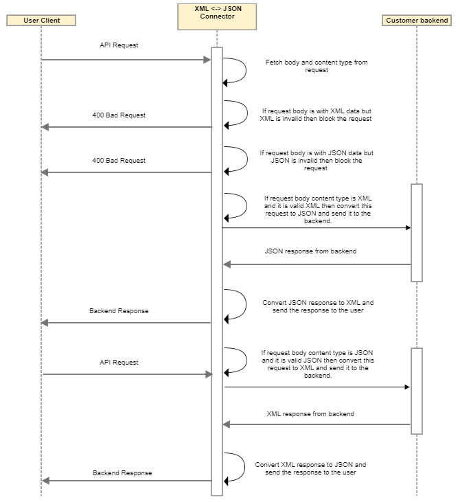
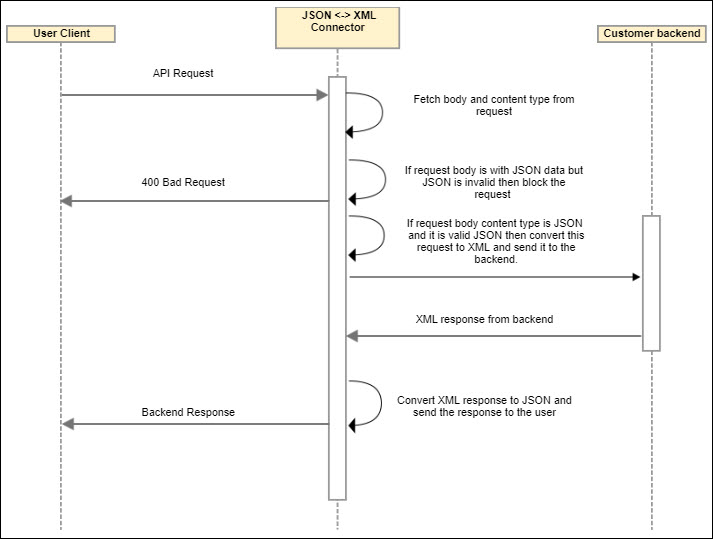

---
sidebar_position: 3
---

# Design and Implementation

<head>
  <meta name="guidename" content="API Management"/>
  <meta name="context" content="GUID-99ee63e0-b443-4f4b-bc56-ff03873ad18e"/>
</head>

## Sequence Diagram
**Scenario 1** 

User Client -->XML -->Connector -->JSON -->Origin Server 

Origin Server -->JSON -->Connector -->XML -->User Client 

**Scenario 2**

User Client -->JSON -->Connector -->XML -->Origin Server 

Origin Server -->XML -->Connector -->JSON -->User Client 

## Implementation Details

- The connector fetches request data and content type from header.

- The connector blocks the request in case of invalid XML request. 

- The connector blocks the request in case of invalid JSON request.

- In pre-processing, if request XML is valid, then the connector converts the XML request to JSON and the call gets forwarded to the backend. 

- In post-processing, if JSON response from backend is valid, then the connector transforms this JSON response to XML response and forwards it to the user client. 

- In pre-processing, if the request JSON is valid, then the connector converts the JSON request to XML and call gets forwarded to the backend. 

- In post-processing, if the XML response from the backend is valid, then the connector transforms this XML response to XML response and forward it to the user client. 

## Business Rule Assumptions

- This connector converts request and response content from XML to JSON and vice versa. 

- **Content type must be present in request header** to find request content type. So this will be the entry point of the connector. If request content type is XML, then it will convert given XML request to JSON; if request content type is JSON, then it will convert given JSON request to XML. 

- While writing JSON to XML, attribute order should follow by the user. If JSON object is associated with attribute, then it should be the first field of that object because attribute will come first in XML, so XML writer expect it should be in first place. For example, JSON with attribute. 

  Valid scenario → `{ "alice": { **"@charlie"**: "david", "$" : "bob" } }`

  It should not start with value \$ In valid scenario → `{ "alice": { "$" : "bob", **"@charlie"**: "david" } }`

