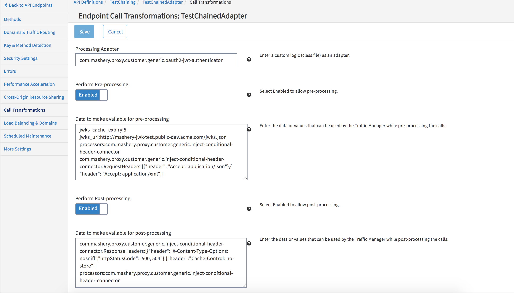

---
sidebar_position: 2
---

# Chaining of Processors Using Mashery_Proxy_Processor_Chain

<head>
  <meta name="guidename" content="API Management"/>
  <meta name="context" content="GUID-45beae45-60de-48d2-a19f-cc2d03639d2d"/>
</head>


To chain processors using Mashery\_Proxy\_Processor\_Chain, complete the following steps:

1. In the Configuration Manager, click the Endpoints tab and then click Call Transformation.

 

1. Input the Adapter name with built-in adapter as Mashery\_Proxy\_Processor\_Chain. 

1. As per your requirement, select the checkbox for Perform Preprocess/Perform Postprocess or both. 

1. In the Preinputs field, type the processors to be chained. The name of the processor is the processor's bean name. The syntax is: 

   ```
   processors:PROCESSOR1,PROCESSOR2
   ```
   

   For example: 

   ```

   processors:com.mashery.local.MasheryCustomProcessorOne, com.mashery.local.MasheryCustomProcessorTwo
   ```
   

   You can also provide configuration data as input. The syntax is: 

   ```
   PROCCESSOR1.parameter:value

   PROCCESSOR1.parameter:value

   PROCCESSOR2.parameter:value

   PROCCESSOR2.parameter:value
   ```

   1. In the pre-input configuration, there must not be more than one key with name "processors". 
   1. The processors to be chained must be input as comma separated list. 
1. In the Postinputs field, input the name of the adapter that the traffic manager can use to post-process the calls, then click Save. 
   1. The input syntax for the Postinputs fields must be the same as the Preinputs field. 
   1. If you opt for only Perform Postprocess, the input for Postinputs field must be as follows: 

      ```
      processors:com.mashery.local.MasheryCustomProcessorOne
      ```
      and 

      ```
      PROCCESSOR1.parameter:value

      PROCCESSOR1.parameter:value
      ```
