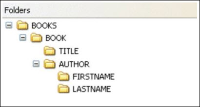

---
sidebar_position: 3
---

# XPath Guide

<head>
  <meta name="guidename" content="API Management"/>
  <meta name="context" content="GUID-a3dbbb43-64ae-4440-af39-84e5e588e766"/>
</head>

XPath expression examples extract information from an XML document by evaluating those expressions. XPath stands for XML Path Language; also XPath uses "path like" syntax to identify and navigate nodes in an XML document. 

## XPath Expression
XPath uses expressions to select nodes or node-sets in an XML document. 

These path expressions look very much like the path expressions you use with traditional computer file systems:



## XPath Syntax

XPath uses path expressions to select nodes or node-sets in an XML document. The node is selected by following a path or steps. 

```xml
<?xml version="1.0" encoding="UTF-8"?>
<bookstore>
<book>
<title lang="en">Harry Potter</title>
<price>29.99</price>
</book>
<book>
<title lang="en">Learning XML</title>
<price>39.95</price>
</book>
</bookstore>
```

## Selecting Nodes

XPath uses path expressions to select nodes in an XML document. The node is selected by following a path or steps. The most useful path expressions are listed below: 

|**Expression** |**Description** |
| --- | --- |
|nodename|Selects all nodes with the name "nodename". |
|/|Selects from the root node. |
|// |Selects nodes in the document from the current node that match the selection no matter where they are. |
|. |Selects the current node. |
|.. |Selects the parent of the current node. |
|@ |Selects attributes. |

The table below lists some path expressions and the result of the expressions: 

|**Expression** |**Results** |
| --- | --- |
|bookstore|Selects all nodes with the name "bookstore". |
|/bookstore|Selects the root element bookstore Note If the path starts with a slash ( / ) it always represents an absolute path to an element! |
|bookstore/book |Selects all book elements that are children of bookstore. |
|//book |Selects all book elements no matter where they are in the document. |
|bookstore//book|Selects all book elements that are descendant of the bookstore element, no matter where they are under the bookstore element. |
|//@lang |Selects all attributes that are named lang. |

## Predicates

Predicates are used to find a specific node or a node that contains a specific value. 

Predicates are always embedded in square brackets. 

The table below lists some path expressions with predicates and the result of the expressions: 

|**Expression** |**Result** |
| --- | --- |
|`/bookstore/book[1]` |Selects the first book element that is the child of the bookstore element. Note: In IE 5,6,7,8,9 first node is[0], but according to W3C, it is [1]. |
|`/bookstore/book[last()]` |Selects the last book element that is the child of the bookstore element. |
|`/bookstore/book[last()-1]` |Selects the last but one book element that is the child of the bookstore element. |
|`/bookstore/book[position()<3]` |Selects the first two book elements that are children of the bookstore element. |
|`//title[@lang]` |Selects all the title elements that have an attribute named lang. |
|`//title[@lang='en']`|Selects all the title elements that have a "lang" attribute with a value of "en". |
|`/bookstore/book[price>35.00]` |Selects all the book elements of the bookstore element that have a price element with a value greater than 35.00. |
|`/bookstore/book[price>35.00]/title`|Selects all the title elements of the book elements of the bookstore element that have a price element with a value greater than 35.00. |

## Selecting Unknown Nodes

XPath wildcards can be used to select unknown XML nodes. 

|**Wildcard** |**Description** |
| --- | --- |
|\* |Matches any element node |
|@\* |Matches any attribute node |
|node |Matches any node of any kind |

The table below lists some path expressions and the result of the expressions: 

|**Expression** |**Result** |
| --- | --- |
|/bookstore/\* |Selects all the child element nodes of the bookstore element. |
|//\* |Selects all elements in the document. |
|//title\[@\*\] |Selects all title elements which have at least one attribute of any kind. |

## Selecting Several Paths

By using the | operator in an XPath expression, you can select several paths. 

The table below lists some path expressions and the result of the expressions: 

|**Expression** |**Result** |
| --- | --- |
|//book/title | //book/price |Selects all the title AND price elements of all book elements. |
|//title | //price |Selects all the title AND price elements in the document. |
|/bookstore/book/title | //price |Selects all the title elements of the book element of the bookstore element AND all the price elements in the document. |

## XPath Operators
Below is a list of the operators that can be used in XPath expressions: 

|**Operator** |**Description** |**Example** |
| --- | --- | --- |
|| |Computes two node-sets |//book | //cd |
|+ |Addition |6 + 4 |
|- |Subtraction |6 - 4 |
|\* |Multiplication |6 \* 4 |
|div |Division |8 div 4 |
|= |Equal |price=9.80 |
|!= |Not equal |price!=9.80 |
|\< |Less than |price\<9.80 |
|\<= |Less than or equal to |price\<=9.80 |
|\> |Greater than |price\>9.80 |
|\>= |Greater than or equal to |price\>=9.80 |
|or |or |price=9.80 or price=9.70 |
|and |and |price\>9.00 and price\<9.90 |
|mod |Modulus (division remainder) |5 mod 2 |

## Example

```xml
<?xml version="1.0" encoding="UTF-8" standalone="yes"?>
<employees>
<employee id="1">
<firstName>Lokesh</firstName>
<lastName>Gupta</lastName>
<department>
<id>101</id>
<name>IT</name>
</department>
</employee>
<employee id="2">
<firstName>Brian</firstName>
<lastName>Schultz</lastName>
<department>
<id>102</id>
<name>HR</name>
</department>
</employee>
<employee id="3">
<firstName>Alex</firstName>
<lastName>Kolenchisky</lastName>
<department>
<id>103</id>
<name>FINANCE</name>
</department>
</employee>
<employee id="4">
<firstName>Amit</firstName>
<lastName>Jain</lastName>
<department>
<id>104</id>
<name>HR</name>
</department>
</employee>
<employee id="5">
<firstName>David</firstName>
<lastName>Beckham</lastName>
<department>
<id>105</id>
<name>DEVOPS</name>
</department>
</employee>
</employees>
```

Now, see a few examples of how to build XPath for getting information based on various conditions on fields and attributes. 

|**Expression** |**Meaning** |
| --- | -- |
|/employees/employee/firstName/text()|Get all employee names |
|/employees/employee/department/name/text() |Get all department names |
|/employees/employee\[department/name='IT'\]/firstName/text() |Get all employees in IT |
|/employees/employee\[@id=4\]/firstName/text() |Get employee by id |
|/employees/employee\[@id>6\]/firstName/text() |Get employees whose Id is greater than 6 |
|/employees/employee\[firstName = 'David'\]/department/name/text() |Get department for David |
|/employees/employee/@id |Get all employee ids |
|/employees/employee\[department/name='HR'\]/@id|Get all employee ids in HR department |
|/employees/employee\[firstName='Alex'\]/@id|Get employee id of 'Alex' |
|/employees/employee/@id\[. > 5\] |Get employee ids greater than 5 |
|/employees/employee\[contains(@id,'1')\]/firstName/text() |Get employee whose id contains '1' |
|descendant-or-self::\*\[contains(@id,'1')\]/firstName/text()|Get employee whose id contains 1 |

## How to Check XPath Syntax

You can use [https://codebeautify.org/Xpath-Tester](HTTPS://CODEBEAUTIFY.ORG/XPATH-TESTER) and check the sample XML example and XPath expression to validate it is working as expected. 
