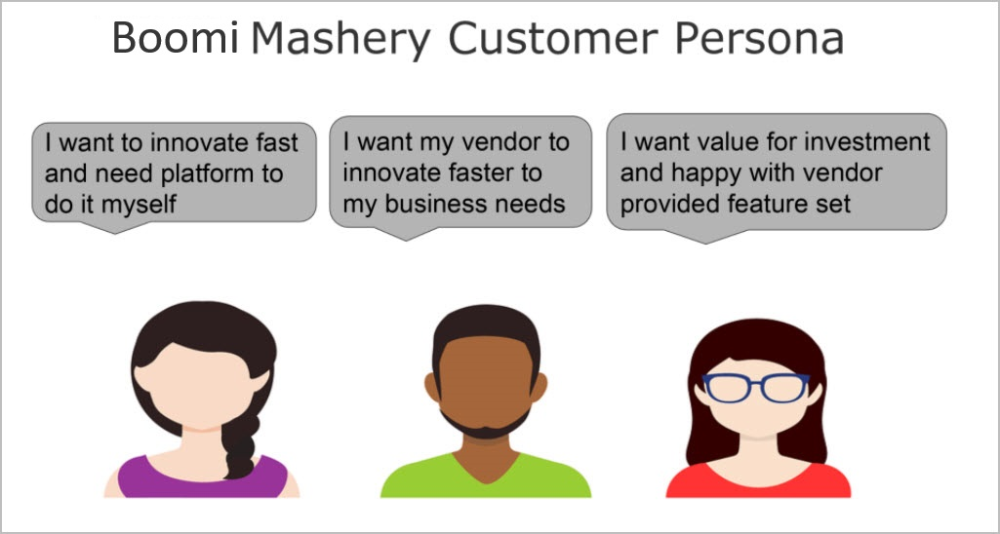

---
sidebar_position: 2
---

# Business Use Case and Inspiration

<head>
  <meta name="guidename" content="API Management"/>
  <meta name="context" content="GUID-c54edc9d-2f03-4761-9595-20ca404b66c7"/>
</head>

API Management AWS Lambda Sidecar integration idea and inspiration came after talking to multiple enterprise customers and prospects to meet their evolving business needs in rapid growing digital transformation world. 

This section provides the 'What' and 'Why' of the Sidecar integration for AWS Lambda. 

## What it is

- API Management integration hook for AWS Lambda function. 

- Minimally coupled with customer business logic implementation yet tightly integrated with API Management Gateway. 

- Lambda function implementation agnostics provided integration specs between API Management and AWS Lambda function is followed accurately. 

- Allows integrating external micro services or app developed and deployed in AWS Lambda with API Management Gateway. 

- Allows implement business policies/rules at Gateway based on Lambda function response.

- Supports both pre processing of user client and post processing of backend response to support configurable and augmented policies at API Management.

## Why sidecar integration

- Strategic cloud platform for tech savvy customers who have technical expertise in development but need a API Management platform that allows them to innovate at rapid pace. 

- Provide reins and control back in customers hand for innovative business policies development by reducing strict dependency on API Management feature roadmap. 

- Customer innovation at faster speed using any AWS Lambda supported popular languages and development platform of choice including Boomi Flogo. For more information about AWS Lambda runtimes, see [AWS documentation](https://docs.aws.amazon.com/lambda/latest/dg/lambda-runtimes.html). 

- Provide robust, scalable platform to run code without provisioning and managing servers infrastructure. 

- Augment digital transformation innovation using app and micro services developed and deployed in AWS Lambda. 

- Empowers customer to better control data governance, client data retention and compliances with PII, PCI, GDPR etc if needed. 

- Allows customers to build customized analytics and insights which are on top of analytics solutions provided by Boomi using data stored in AWS Lambda if needed. 

## Sidecar Integration in Simple Terms

In simple terms API Management Gateway Sidecar integration asks AWS Lambda function : "Can I send this API request to backend API server / User Client?". The Lambda function replies either of the following: 

- Yes, without additional modifications to API call.

- Yes, with provided modifications to the API call.

- No, with provided error code and message. 
