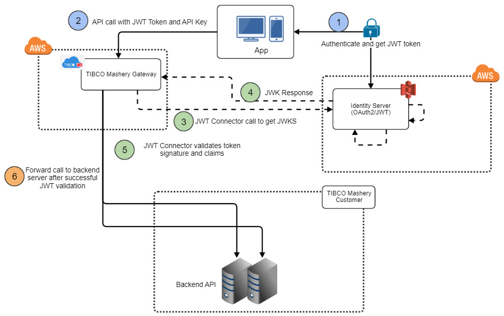
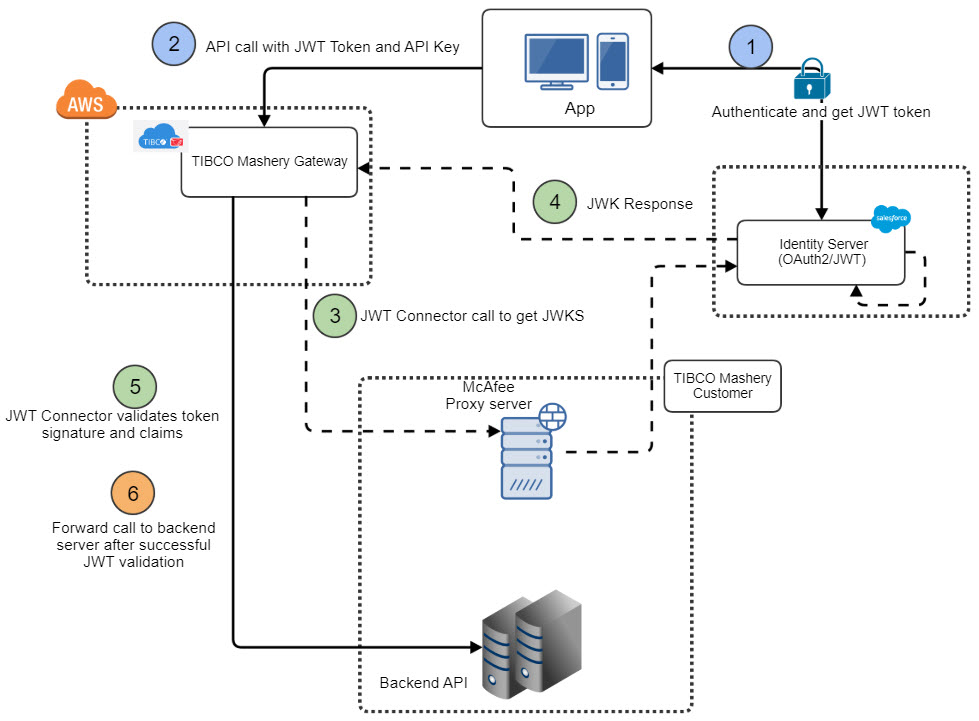
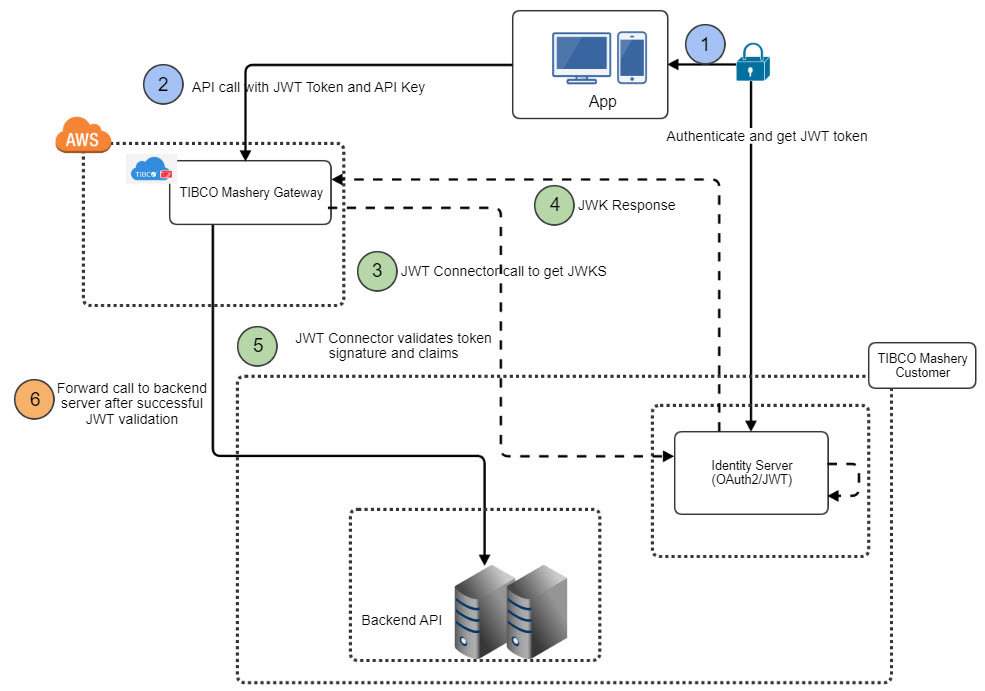

---
sidebar_position: 3
---

# API Management Use Case Scenario

<head>
  <meta name="guidename" content="API Management"/>
  <meta name="context" content="GUID-c38c8c3c-fd2b-4e63-af4e-3574c077d88f"/>
</head>

:::note

This section describes several system deployment architectures for reference, but is by no means limited to any specific cloud platform, third party IDP, or third party proxy server. 

:::

## External IDP without third party Proxy Server in VPC

JWT System Architecture in Cloud Without Proxy Server

## External IDP with third party Proxy Server in Cloud

JWT System Architecture in Cloud With Proxy Server 

## External IDP without third party Proxy Server in customer environment

JWT System Architecture in Data Center Without Proxy Server 

