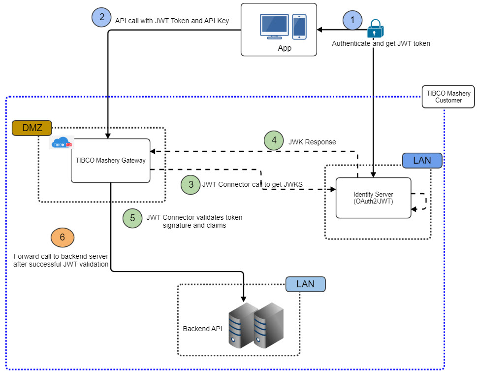

---
sidebar_position: 4
---

# Local Edition Use Case Scenario

<head>
  <meta name="guidename" content="API Management"/>
  <meta name="context" content="GUID-ba5720ad-a4b4-4857-9b0f-b2b5732b1ffd"/>
</head>

:::note

This section describes several system deployment architectures for reference, but is by no means limited to any specific cloud platform, third party IDP or third party load balancer. 

:::

## External IDP with API Management in DMZ in Datacenter

JWT System Architecture in Datacenter Without Proxy Server 

## External IDP with API Management in DMZ and Load Balancer in Datacenter

JWT System Architecture in Datacenter With Load Balancer 

