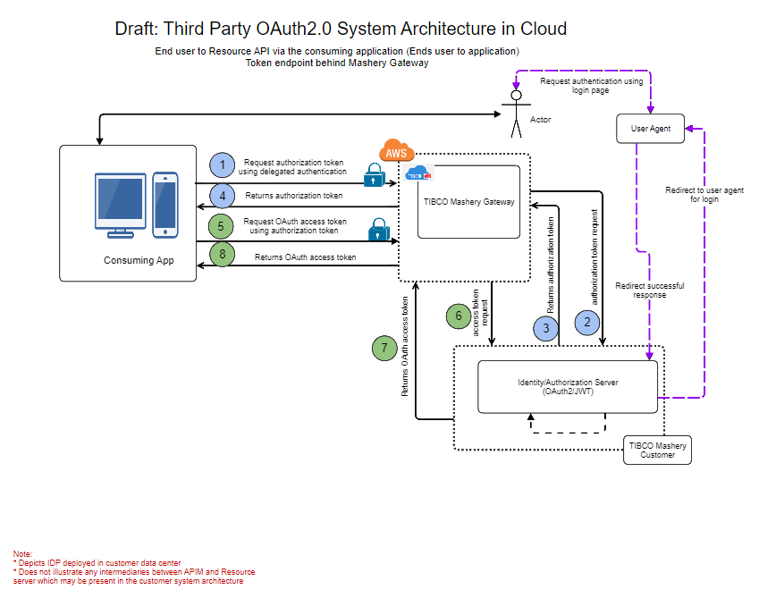

---
sidebar_position: 4
---

# Authorization Code Flow

<head>
  <meta name="guidename" content="API Management"/>
  <meta name="context" content="GUID-ac6e5335-baf4-4dc0-9ec6-e2b1eec52328"/>
</head>

**Used in**: End user to Resource API via the consuming application (Ends user to application) 

**Flow Type**: Three Legged OAuth 

## Authorization Code Flow (Third Party Token Endpoint Behind API Management)

**Used in**: End user to Resource API via the consuming application (Ends user to application) 

**Flow Type**: Three Legged OAuth 

:::note

Protecting third party OAuth2.0 token endpoint behind API Management. Sample reference for demonstration. You need to consult your security team, if above proposal fits your security requirements accurately. 

:::

