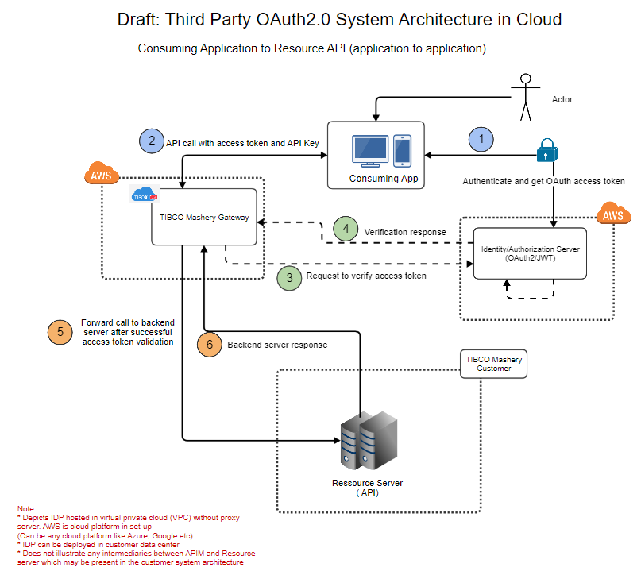
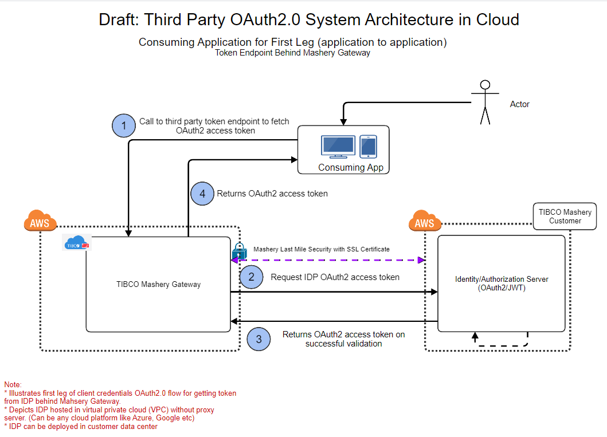

---
sidebar_position: 2
---

# Client Credentials Flow 

<head>
  <meta name="guidename" content="API Management"/>
  <meta name="context" content="GUID-b4d40eaf-a96d-4ce8-89af-3df852045867"/>
</head>

**Used in**: Consuming Application to Resource API (application to application) 

**Flow Type**: Two Legged OAuth 

**Client Credentials Flow (Third Party Token Endpoint Behind API Management)**

**Used in**: Consuming Application to Resource API (application to application) 

**Flow Type**: Two Legged OAuth 

note:::

Protecting third party OAuth2.0 token endpoint behind API Management. Sample reference for demonstration. You need to consult your security team, if above proposal fits your security requirements accurately. 

:::

