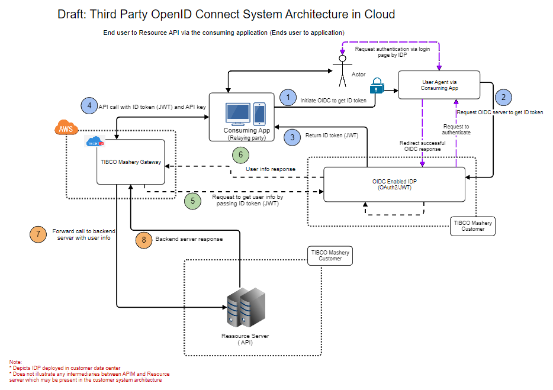

---
sidebar_position: 5
---

# Flow

<head>
  <meta name="guidename" content="API Management"/>
  <meta name="context" content="GUID-3883ba45-1d77-4502-87d0-925bfdd9a0af"/>
</head>

**Used in**: Consuming application to Resource API (End user to application) 

**Flow Type**: Three Legged OpenID Connect 

# OpenID Connect Flow (Third Party Token Endpoint Behind )

**Used in**: Consuming application to Resource API (End user to application) 

**Flow Type**: Three Legged OpenID Connect 

Protecting third party OIDC token endpoint behind API Management. Sample reference for demonstration. You need to consult your security team, if above proposal fits your security requirements accurately. 
