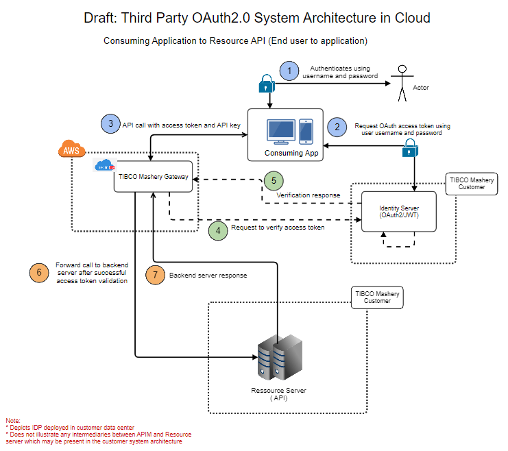

---
sidebar_position: 3
---

# Resource Owner Password Flow

<head>
  <meta name="guidename" content="API Management"/>
  <meta name="context" content="GUID-5ecdbe38-4d40-4a48-ba14-43d0affdc1d3"/>
</head>

**Used in**: Consuming application to Resource API (End user to application) 

**Flow Type**: Two Legged OAuth 

# Resource Owner Password Flow (Third Party Token Endpoint Behind )

**Used in**: Consuming application to Resource API (End user to application). 

**Flow Type**: Two Legged OAuth 

Protecting third party OAuth2.0 token endpoint behind API Management. Sample reference for demonstration. You need to consult your security team, if above proposal fits your security requirements accurately. 