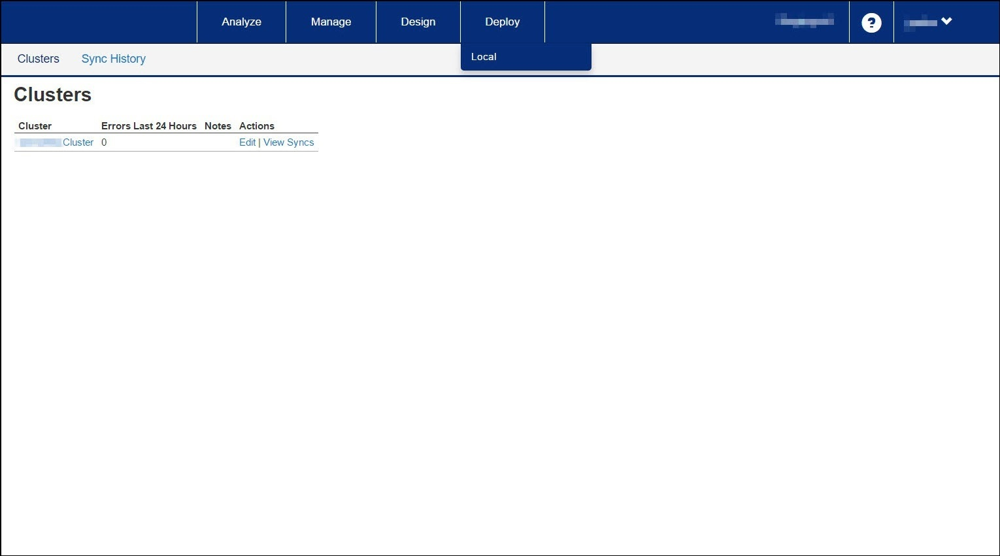

---
sidebar_position: 2
---

# Viewing Clusters

<head>
  <meta name="guidename" content="API Management"/>
  <meta name="context" content="GUID-85de645f-6f9f-4179-a3e5-0f18cdbe2ca3"/>
</head>

Clusters are created to efficiently manage the API traffic in the client's local environment. Depending on the capacity of your network, a number of clusters can be created. You must consult  API Management Support to create or delete the clusters. 

## Deploy > Local

The following table describes the fields on the Clusters page. 

|**Field or Section**|**Description**|
| --------- | -------- |
|Cluster|Cluster name. |
|Error Last 24 Hours|List of errors occurred in the last twenty-four hours. |
|Notes|Additional information saved as notes. |
|Actions|
The actions include: 

- **Edit:** Allows modifying the cluster note. The cluster name cannot be edited. 

- **View Syncs:** Displays the syncs associated with the cluster on the **Sync History** page. 
|

