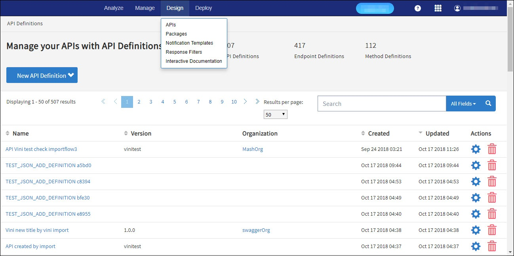

---
sidebar_position: 1
---

# API Definitions

<head>
  <meta name="guidename" content="API Management"/>
  <meta name="context" content="GUID-d42c4acd-3bd9-47d1-806f-8ba0aff8454d"/>
</head>

An API definition is a set of configurable properties that specify the function of an API within the Traffic Manager. After creating API definitions, you can create endpoints and method definitions for the API. 

The following user roles can access the **API Definitions** tab: 

- Administrator

- API Manager 

The landing page of the **API Definitions** tab displays a navigable list of API definitions. This list is paginated such that the APIs are displayed in groups of 50. You can use the navigation buttons at the bottom of the list to navigate to the rest of the API list pages. If less than 50 APIs are registered, the navigation buttons are not visible. 

## Design > APIs

For more information, see [Creating an API](Creating_api_definitions.md). The following table describes the fields on the API Definitions tab. 

|**Field** |**Description** |
| ------- | --------- |
|Name|Name of the API. |
|Version|Version of the API. |
|Organization|Name of the Organization to which the API belongs. For more information, see [Organizations](../../ManageControls/Distributedapimanagement/Organizations/Organization_overview.md). |
|Created|The date and time when the API definition was created. |
|Updated|The date and time when the API definition was updated. |
|Actions| |
||Navigates to the **API Definition Settings** page, where properties of the API can be edited. For more information, see [API Definition Settings](API_definition_settings.md). |
||Deletes the API definition. |

