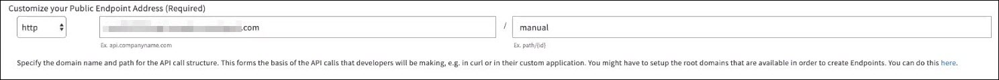

---
sidebar_position: 3
---

# Domains and Traffic Routing

<head>
  <meta name="guidename" content="API Management"/>
  <meta name="context" content="GUID-93110a53-30ec-402b-b07f-448df2944f98"/>
</head>

The **Domains and Traffic Routing** page allows you to edit an existing endpoint definition. You can modify the name, Public endpoint address, and Traffic Manager endpoint address on this page. Note that if enhanced security is enabled while creating the endpoint, the respective field is not displayed on this page. Hence, once enabled, the enhanced security for that endpoint cannot be disabled.

The following table describes the fields on the `**API Endpoint Settings: <Endpoint Name>**` page. 

|**Field** |**Description** |
| ------- | ------ |
|Your Public Endpoint Domain|Public domain name that developer application or widget uses to make an API call. It can be defined in the **Customize your Public Endpoint Address** field. |
|Your Public Traffic Manager Domain|
The API Management internal host name (domain name) to which the requested public domain name is CNAMED. 

The Traffic Manager domain name can be edited by clicking the **Edit** link in the top ribbon on the page. However, you must consult API Management before editing the API Management internal domain name.
|
|Your Endpoint Domain|
The URI path of the host server that the Traffic Manager uses to send an API call. The Traffic Manager performs call logging, and applies the configured rules before sending an API call. 

:::note

Your endpoint domain is shown when the endpoint is manually configured. If TIBCO Cloud Mesh is used for the endpoint, the endpoint domain is not displayed.

::: 
|
|Name|The endpoint name which is reflected wherever this endpoint is mentioned. |
|Require Enhanced Security|
Allows you to define whether an SSL certificate is required for the endpoint. If enabled, all calls made to this endpoint are required to be made using SSL. Consult API Management Support to enable this setting if not visible on the page. 

This field is not displayed if enabled while creating the endpoint. In other words, This field cannot be edited after the endpoint is created. 

:::note

After the **Require Enhanced Security** field is enabled, the **transport protocol** field is modified to **https** for both the internal and external URIs. These fields cannot be changed to http or other protocols. 
|
|Customize your Public Endpoint Address|
Allows you to define the public domain name and path for the endpoint. This path is used by developers when they make calls to this endpoint by using curl or other applications. 

:::note

To create endpoints, you must set up root domains. To add a domain, click the here link as shown in the following image.

::: 

|
|Your Endpoint|
Select one of the following options: 

- **Manual entry** - Allows you to define the URI path of the host server that the Traffic Manager uses to send an API call. The Traffic Manager performs call logging, and applies the configured rules before sending an API call. 

The domain name and path can be defined for the endpoint in this field. 

:::note

To create endpoints, you must set up root domains. To add a domain, click the here link.

::: 

- **TIBCO Cloud Mesh** - TIBCO Cloud Mesh allows you to discover any private REST endpoint exposed within Boomi Cloud domains, within your organization or related organizations. 

Authentication and authorization for these private endpoints is provided automatically. You can browse available services and select one, rather than copying and pasting a URL. 

:::note

For more information on TIBCO Cloud Mesh, refer to the *TIBCO Cloud Mesh* topic in the Boomi Subscriber Cloud documentation.

::: 

If **TIBCO Cloud Mesh** is selected, specify an endpoint using the Select endpoint link. 

In the pop-up window, select a service. You can click on the specific service, or type in the **Search service name, description bar** to search for and find a matching service by name or description.

In the next pop-up window, select a path from the **Paths** list.

Use the > button to review the available operations for the path, then click **Select**.
|
|Your Endpoint Address|
Specify the domain name, path and parameters for the API call that will be sent to the Endpoint system that contains your data. 

:::note

If TIBCO Cloud Mesh is used for the endpoint, this field is not displayed. To create endpoints, you must set up root domains. To add a domain, click the here link.

::: 
|

