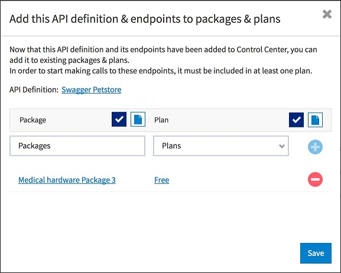

# Importing API Definition Files

<head>
  <meta name="guidename" content="API Management"/>
  <meta name="context" content="GUID-db37b6d6-b7e8-4268-b2d1-12a717bf9ef3"/>
</head>

:::note

You must be an Area Level Administrator to import an API definition from a Swagger file. For more information on Administrator roles, see [Control Center Roles](../../ManageControls/Users/AddingandRemovingRolesviaAccessSettings/Control_center_roles.md). 

:::

## Procedure

To upload a Swagger document and convert it to a new API definition: 

1. On the **API Definition** page, click New **API Definition**, then select **Import a File**. 

   :::note
   
   For information on using the Create manually option, see [Creating an API Definition](Creating_api_definitions.md). 

   :::

2. In the **Import an API Definition File** window, click **Choose File**. 

   Navigate to the Swagger file to import, then click **Open**. 

   Use the **Organization** drop-down list to specify the organization owner of this API. 

   :::note
   
   Only users with API permissions in this organization will be able to edit this definition. 

   :::

3. After the selected file is displayed and organization is specified, click **Preview**. 

   The **Preview** window displays the objects that are going to be created, and allows you to decide which endpoints to create (automatically selected, by default) and not create. 

   Ensure that the API specification conforms to Swagger specification version 2.0 and the file format is JSON. To open the JSON file directly from this window, click the file link in the **Uploaded API Definition** field. If the information looks correct, click Create to continue creating your API definition. 

4. If the API definition is successfully created, a Success window is displayed. 

   :::note
   
   If duplicate endpoints are found or if the domain is not active, the API definition cannot be created. Duplicate endpoints must be either removed from API Control Center or removed from the Swagger document you are trying to import. 

   :::

5. (Optional) Click **View Your New API** to view the **Interactive Documentation** page, which displays the Interactive Documentation that is automatically created based on the newly-imported Swagger specification. This is a fully- functional Interactive Documentation, and uses the specifications from the imported JSON. For more information on Interactive Documentation, see the [Interactive Documentation](../Interactivedocumentation/Interactive_documentation.md) topic. 

6. (Optional) Click **Add Interactive Documentation** to add the API definition as an Interactive Documentation item.

   In the **Add Interactive Documentation** pop-up window, specify the uploaded API definition as either an **IO Doc or Swagger document**, then click **Save**.

7. (Optional) Click Edit Interactive Documentation (to edit the API definition document) or Add to Packages and Plans (to add the API definition or endpoint to an existing (or new) package or plan).

   a. If **Edit Interactive Documentation** is selected, you can further edit the API definition in the **`Edit Interactive Documentation: <endpoint name>`** page. 

      When finished, click **Save**. 

   b. If **Add to Packages** and **Plans** is selected, use the Packages selector to navigate to your existing package, use the Plans selector to navigate to your existing plan, then click **Save**.

      

To add the API definition or endpoint to a new package, use the **Package** create button to create a new package. 

Enable the **allow self-provisioning** keys checkbox to permit the use of keys without requiring developer approval. 

Then, use the **Plan** create button to create a new plan, then click **Save**. 

Once the API definition and all of its endpoints have been successfully added to the new package and plan, click **Close**. 

