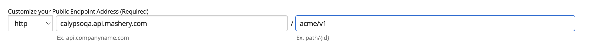
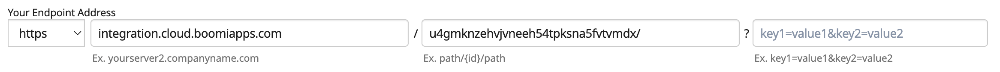

---
sidebar_position: 2
---
# Managing your first API

<head>
  <meta name="guidename" content="API Management"/>
  <meta name="context" content="GUID-f3c9e131-57a3-444a-bb6c-a30e98dfcc4b"/>
</head>

Assuming that your alias is given as evalXXXX, go to your Boomi Cloud API Management portal URL: `https://evalXXXX.admin.mashery.com`, fill in your credentials, and click **Sign In**. You should be on the **Get Started** page after logging in to the Boomi Cloud API Management.

The Boomi Cloud API Management **Get Started** page is an administrative dashboard (also known as API Control Center) that lists several common tasks.

Now you can start configuring an API Definition with endpoint definitions. To configure method definitions, see [Creating sample API](#creating-sample-api). 

## Creating Sample API

1. Click **API Definitions** on the **Get Started** page or navigate to **Design>APIs**. This opens **Manage your APIs with API Definitions** page.

2. Create a new API by choosing **Create your first API Definition**, **Create your first API Definition by Importing a file**, or **Create your first API Definition by importing from URI**. This opens **New API Definitions** page. 

3. In **New API Definition** page, provide the following values:

   1. **API Definition Name**: Enter the name of your API. For example, **Acme API**.
   
   2. **Description:** Leave it empty for now. 
   
   3. **API Version:** Enter 1.0 API version.
   
   4. **Organization:** Leave as the default. You can use the list to select one of the other pre-defined organizations. 
   
   5. Click **Save and Continue**. This opens up the **API Definitions** page for Acme API. You can see the API Definitions once they have been created. 
   
   In the left navigation menu, you can see all the options available: 

   - **Endpoints:** The list of all the endpoints created for the API (the current view). 

   - **API Definition Settings:** Overall API definition settings, including the name, description, and version that were just configured.

   - **Security Settings:** Whether you want to enable OAuth for this API. 

   - **Error Sets:** Custom error messages you want to create for this API. 

   - **Interactive Documentation Access Control:** Controls which groups are allowed access to view the API definition in the portal. The portal displays only those Interactive Documentation that are appropriate for the user’s given roles.
   
   - **Performance Acceleration:** Controls how to setup caching for this API. 

   - **API History:** It shows the history of the changes done to the API definition.

   - **Client Usage Report:** This report shows the list of clients having access to the service.

3. Navigate to **Endpoints** and select **Create your first Resource Endpoint**. This opens **Endpoint Create: New Endpoint Definition** page.

   :::note
   
   If you have previously created an endpoint, you can click  button to create another endpoint. 

   :::

   In the **Endpoint Create: New Endpoint Definition** page, enter the following value: 
   
      1. **Name for your Endpoint**: Default 
      
      2. **Customize your Public Endpoint Address**: The first field is pre-filled to your trial area. For example, `evalXXXX.api.mashery.com.` In the second field, enter: `acme/v1`.

         

         :::note
            
         For the first text box, this value is typically set to a domain name that matches your domain such as api.your-company-name.com or service.your-company-name.com. For the purposes of this quick start example, the domain name provided by API Management is used.
            
         For the second text box, the Path used on the Public Endpoint Address identifies this specific endpoint configuration for this specific service/API, with an assumed wildcard at the end of the path. The path prefix used must be unique across your API Management instance. 

         :::
      
      3. **Your Endpoint Address**: 

         1. Set the Protocol to: **HTTPS**
         
         2. First text box: **integration.cloud.boomiapps.com**
         
         3. Second text box: **`u4gmknzehvjvneeh54tpksna5fvtvmdx/`** (include the trailing `/`) 
         
         4. Third text box: Leave it blank.
        
            

            :::note
         
            - For values in the first text box, request your hostnames to be white-listed on API Management. Contact [Boomi Support](https://community.boomi.com/s/support) for enabling specific domains to be white-listed. 
         
            - The second text box provides the ability for a URL to rewrite from the configured Public Endpoint Address.
         
            - Given the scenario thus far, the URL of `http://evalXXXX.boomi.com/acme/v1/product` maps to **`https://integration.cloud.boomiapps.com/u4gmknzehvjvnee h54tpksna5fvtvmdx....`**

            :::

         5. Click **Create**. 

5. Click **Interactive Documentation Access Control** in the left navigation menu, select **Everyone** in the **Current Roles** field, and then click **Save**.

   :::note
   
   By default, no one can see this API as you update your definition. You can create custom roles to enable specific developers to see this API. This quick start example allows **Everyone** to see the API. 
   
   :::

6. Change the default API Management behavior for passing query parameters to exclude the passing of the API key: 

   :::note
      
   By default, API Management passes all query parameters it receives onto the backend application, including the API key. Some backend applications do not handle unexpected parameters well, maybe by giving an invalid response or a message saying it received too many arguments.
      
   API Management provides fine control over what is sent to the backend application, with the option to exclude the passing of the API key. 
   
   :::

      1. Click **Endpoints** in the left navigation menu to see the list of default resource endpoint definitions created in Step 3.
      
      2. Click on the default endpoint to create your first Method definition. 
      
      3. In the left navigation menu, select **More Settings**. 
      
      4. Set the **Remove API Key and Signature Query Parameters from Backend Call** to **Enabled** and click **Save**. 

