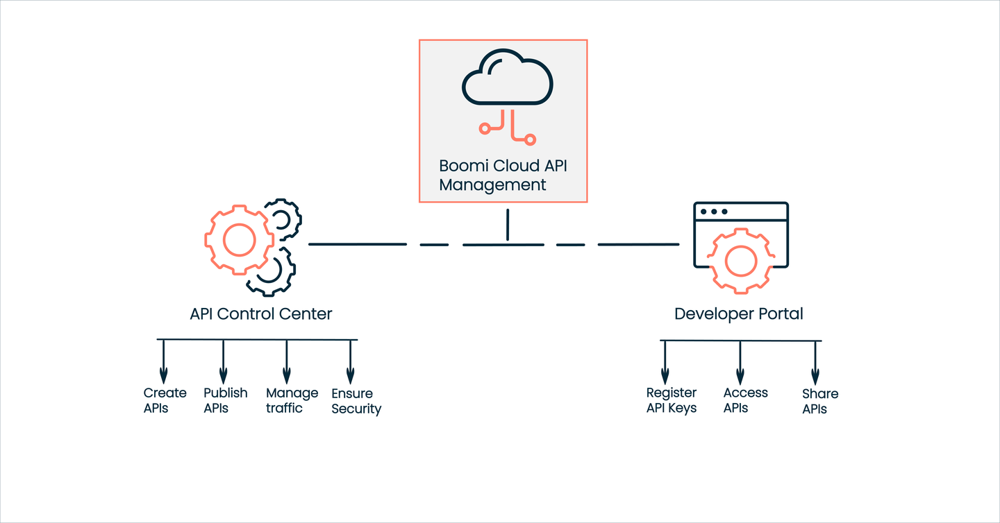

---
sidebar_position: 1
---

# Getting Started with Boomi Cloud API Management

<head>
  <meta name="guidename" content="API Management"/>
  <meta name="context" content="GUID-27d967b9-9fbf-4f25-8e2c-d31c29682567"/>
</head>

## Overview 

Boomi Cloud™ API Management is a SaaS-based API platform that delivers key API management capabilities to all digital applications located on-premises or in the cloud. It manages, secures, and exposes APIs and includes features such as throttle, caching, and call transformation. This allows you to operate more efficiently, gain real-time actionable insights, and create an engaging experience for your users.

The main components of Boomi Cloud API Management are:

- API Control Center -  API Control Center (or API publisher) is an administrative dashboard for creating and publishing your APIs. In the API Control Center, you, as the administrator, can perform various tasks, such as creating an API definition, packaging, planning, managing API traffic, and viewing reports of APIs consumed. As it is a SaaS-based API platform, no installation is required. To learn more, see [API Control Center](#api-control-center).

- Developer Portal - The Developer Portal(or API consumer) is an easily customizable portal that API consumers or developers use to learn API programs, register API keys, and test them through interactive documentation. The keys registered in the Developer Portal are used to identify APIs of an area in the API Control Center. The area administrators must enable and assign these keys to the managed user accounts in the API Control Center. To learn more, see [Developer Portal](#developer-portal).

:::info

If you are a new user and want to learn more about Boomi Cloud API Management features and pricing, or if you just have a question, we are here to help! Please reach out to the [Boomi - Support Center](https://community.boomi.com/s/support) team.

:::

## API Control Center

API Control Center is a SaaS-based administrative dashboard that lets you manage the settings and configurations of an API. When you create an API definition and add package and plan to it, the traffic manager enforces rules on the API. These rules include permissions such as which APIs a given API key can access, how much caching and throttling an API needs, and whether or not call transformation is needed.

Every registered user in the Boomi Cloud API Management area has role-based access to the API Control Center resources. To learn more about roles and permissions, see [Control Center Roles](../ManageControls/Users/AddingandRemovingRolesviaAccessSettings/Control_center_roles.md)

Each registered user of an organization in the Boomi Cloud API Management has permission to access only specific menus in the API Control Center. Only the **Administrator**, **API manager**, **Community manager**, or **Reports user** role can access the API Control Center. To learn more, see the [Relationship Diagram](../ManageControls/Distributedapimanagement/Organizations/Organizations.md#relationship-diagram).

## Developer Portal

The Developer Portal is an easily customizable portal API consumers or developers use to learn API programs, register API keys, and test them through interactive documentation. The keys registered in the Developer Portal are used to identify APIs of an area in the API Control Center. The area administrators must enable and assign these keys in the API Control Center for the managed user accounts. 

:::note

The Boomi Support Team is not responsible for managing users in the Developer Portal. Customers should manage their developers and users in the Developer Portal.

:::

