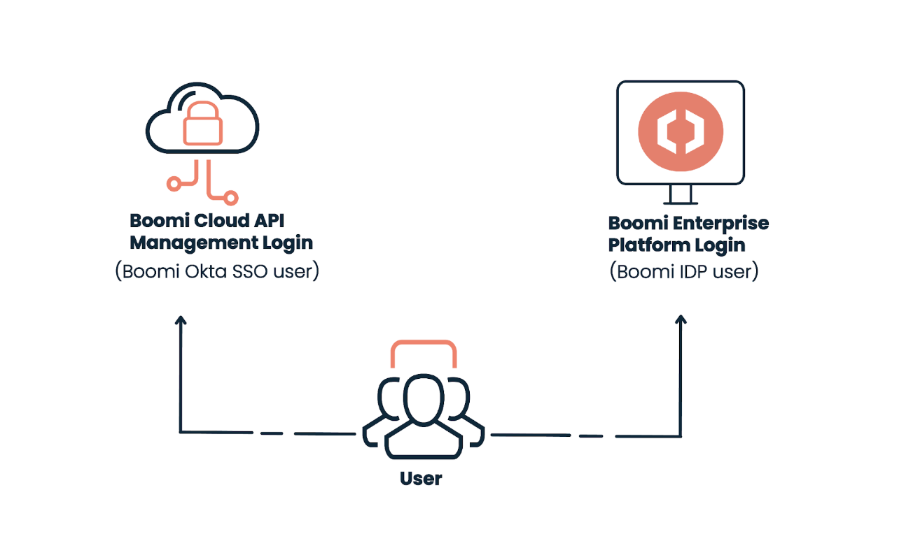

# Sign-in Options for Boomi Cloud API Management

<head>
  <meta name="guidename" content="API Management"/>
  <meta name="context" content="GUID-cfeebe3e-1a4e-4185-a65e-7825a2898087"/>
</head>

Depending on whether you are a Boomi Okta SSO or IDP-enabled user, you can log in to Boomi Cloud API Management using the **Boomi Cloud API Management** or **Boomi Enterprise Platform** login page. 

## Next Steps

- Set up your account in Boomi Cloud API Management Area. To learn more, see [Setting up an Account in Boomi Cloud API Management Area](../GettingStarted/SigninginProcess/Setting_up_account_in_cam_area.md).

- Sign in to Boomi Cloud API Management using **Boomi Enterprise Platform Login** or **Boomi Cloud API Management Login** page.

  - If you are a **Boomi Cloud API Management area administrator**, see [Signing-in process for Boomi Cloud API Management Users](../GettingStarted/SigninginProcess/Signing_in_process_for_cloud_api_management_users.md)
  
  - If you are a **Boomi Enterprise Platform-enabled area administrator**, see [Signing-in process for Boomi Enterprise Platform Users](../GettingStarted/SigninginProcess/Signing-in_process_for_platform_users.md). 