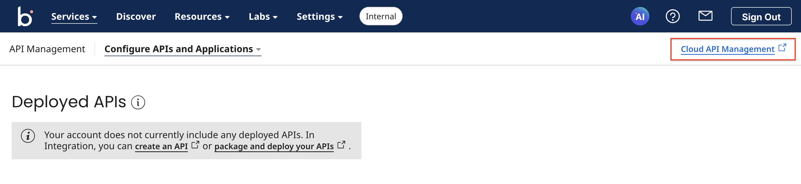
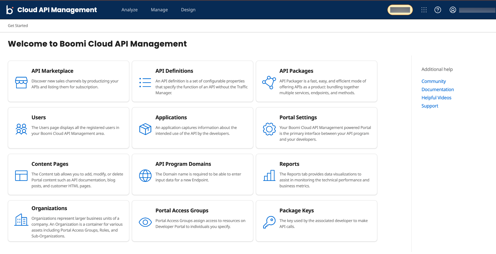
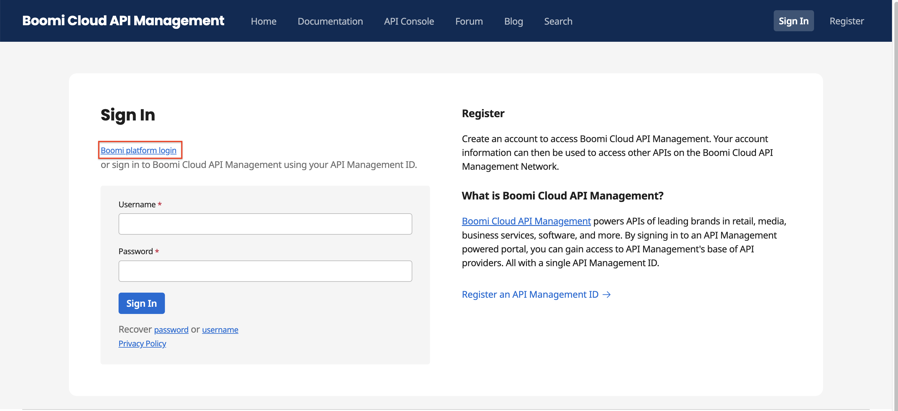
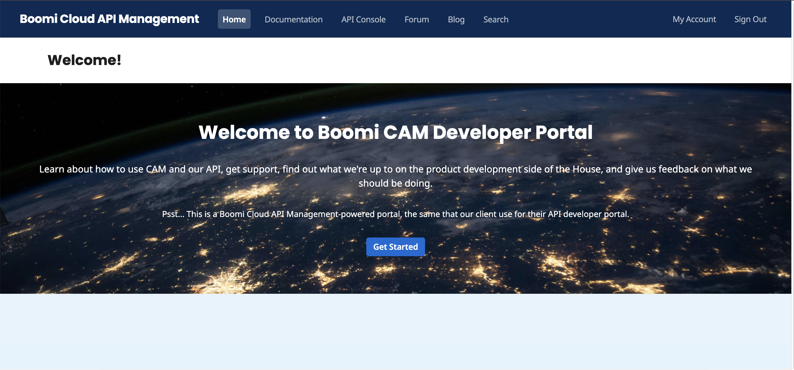

# Signing-in process for Boomi Enterprise Platform Users

This section includes the sign-in steps for Boomi IDP or customer IDP-enabled users to log in to Boomi Cloud API Management (or API Control Center) and Developer Portal using the Boomi Enterprise Platform. 

## Signing in to API Control Center using Boomi Enterprise Platform

<head>
  <meta name="guidename" content="API Management"/>
  <meta name="context" content="GUID-2b201f2a-dbf8-420a-a96c-4ad7fd6321ed"/>
</head>

### Procedure

1. Go to the Boomi Enterprise Platform URL: [https://platform.boomi.com](https://platform.boomi.com).

2. Sign in using the Boomi IDP or customer IDP-enabled login option. The Boomi Enterprise Platform dashboard is displayed.

3. In the **Services** tab, navigate to **APIM Management** and select **Cloud API Management**.
    

    The API Control Center of the Boomi Enterprise Platform is displayed. 

    

4. Publish your APIs or login to the Developer Portal via API Control Center. 

    1. To publish your first API, see [Publishing your APIs](../../GettingStarted/APIPublishing/Publishing_steps/Publishing_your_APIs.md).
    
    2. To sign in to the Developer Portal, click on the square icon at the top right corner of the API Control Center and select **Developer Portal**.

5. Go to your profile and click **Sign out**. 

## Signing in to API Control Center via Boomi Enterprise Platform enabled login

### Procedure

1. Go to your Boomi Cloud API Management portal URL: [http://evalXXXX.admin.boomibus.mashspud.com](http://evalXXXX.admin.boomibus.mashspud.com).

2. Sign in using Boomi IDP login option. Click **Boomi Platform account** login. The Boomi Enterprise Platform dashboard is displayed.

3. In the **Services** tab, navigate to **APIM Management** and select **Cloud API Management**. The Boomi Enterprise Platform-enabled API Control Center is displayed. 

4. Publish your APIs or login to the Developer Portal via API Control Center. 

    1. To publish your first API, see [Publishing your APIs](../../GettingStarted/APIPublishing/Publishing_steps/Publishing_your_APIs.md).

    2. To sign in to the Developer Portal, click on the square icon at the top right corner of the API Control Center and select **Developer Portal**.

5. Go to your profile and click **Sign out**. 

## Signing in to Developer Portal via Boomi Enterprise Platform enabled login

### Procedure

1. Go to the customer Developer Portal URL: [https://evalXXXX.boomibus.mashspud.com/login](https://evalXXXX.boomibus.mashspud.com/login)
   
2. Click **Boomi Platform account login** provide your credentials and click **Sign In**. The Boomi Enterprise Platform dashboard is displayed.

    

    a. Click **Cloud API Management** to sign in to API Control Center. 

    b. Click on the square icon at the top right corner of the API Control Center and select **Developer Portal**. The Boomi Enterprise Platform-enabled Developer Portal is displayed. 

            