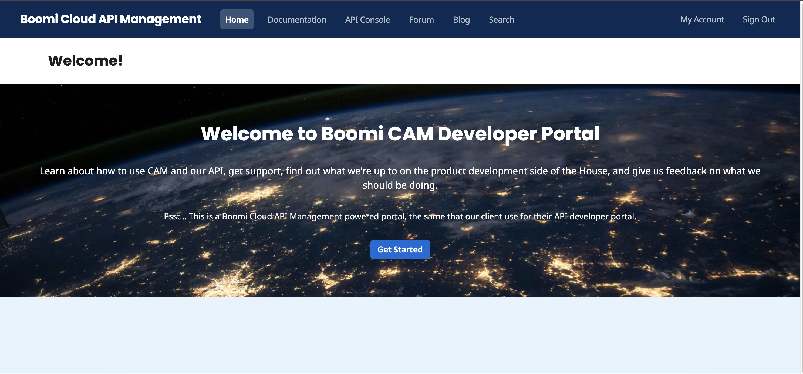

# Signing-in process for Boomi Cloud API Management Users

<head>
  <meta name="guidename" content="API Management"/>
  <meta name="context" content="GUID-adb021a8-9d99-4a96-8140-ea951fbc1c0e"/>
</head>

This section includes the sign-in steps for Boomi Okta SSO users to log in to Boomi Cloud API Management (or API Control Center) and Developer Portal. 

You can sign in to the API Control Center by one of the following ways:

## Signing in to API Control Center 

### Procedure

1. Go to the Boomi Cloud API Management URL: [https://evalXXXX.admin.mashery.com](https://evalXXXX.admin.mashery.com).
   
2. Provide your credentials and click **Sign In**. The API Control Center is displayed.

      

## Signing in to API Control Center via Developer Portal

### Procedure

1. Go to the customer Developer Portal URL: [http://evalXXXX.mashery.com](http://evalXXXX.mashery.com). 

   :::info
   
   The URL of a client developer portal generally conforms to the following syntax: `http://developer.company.com`. 

   For example, if the client name is "Acme, Inc.", the developer Portal URL is: `http://developer.acme.com/`. 
   
   :::
   
2. Provide your credentials and click **Sign In**. The Developer Portal is displayed.

3. Click **Dashboard** at the top right corner of the Developer Portal to sign in to the API Control Center.

   :::note
   
   The **Dashboard** option on the Developer Portal is available only  users with Administrator rights. After you have logged into the API Control Center dashboard, you can publish your first API. To learn more, see [Publishing your APIs](../../GettingStarted/APIPublishing/Publishing_steps/Publishing_your_APIs.md).

   :::

## Signing in to Developer Portal

### Procedure

1. Go to the customer Developer Portal URL: [http://evalXXXX.mashery.com](http://evalXXXX.mashery.com). 
   
2. Provide your credentials and click **Sign In**. The Developer Portal is displayed.

            
