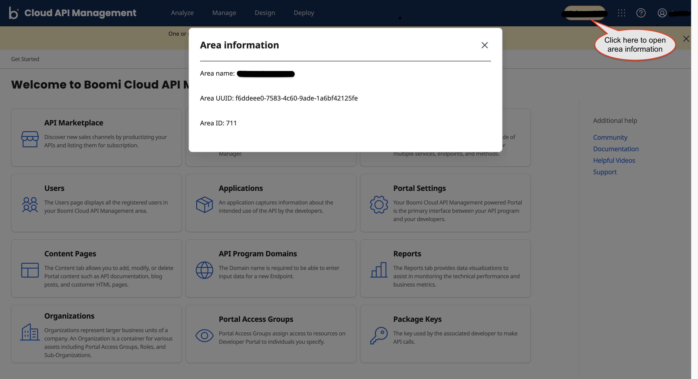

---
sidebar_position: 5
---
# Viewing Area UUID and Traffic Manager Domain

<head>
  <meta name="guidename" content="API Management"/>
  <meta name="context" content="GUID-f78ce97c-394a-4c5a-ae5b-e1a87df3d515"/>
</head>

## Procedure

1. Click **Area** to open the Area information window.

    

2. In the Area information window, get the following parameters:
    - **Area name**
    - **Area UUID**
    - **Area ID**
    - **Traffic Manager Domain**

      :::info
      
      You can get the **Traffic Manager Domain** from the **Area name** parameter. For example, if the **Area name** is `eval996802`, then the **Traffic Manager Domain name** will be `eval996802.api.mashery.com`.

      The **Area UUID** and **Traffic Manager Domain** parameters are needed when publishing an endpoint to Boomi Cloud API Management using Boomi Cloud Integration. 
      
      :::

