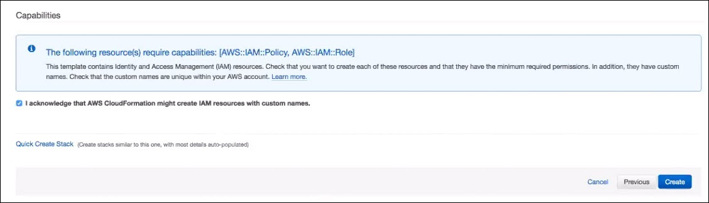

---
sidebar_position: 4
---

# Configuring Your AWS Marketplace Account

<head>
  <meta name="guidename" content="API Management"/>
  <meta name="context" content="GUID-46240121-e483-492e-9c2f-bc853706f538"/>
</head>

After you've created your AWS Marketplace API Listing, you'll need to create some constructs in your AWS account that lets API Management interact with your listing. Delegating AWS Marketplace Listing management capabilities can be achieved by:

- Creating a purpose-built, least-privilege-oriented IAM Role and associated IAM Policy.

- Enabling a trust relationship (between API Management and the generated IAM role) that permits issuance of temporary credentials to the Entitlement Synchronization Service for the purpose of enforcing subscriber entitlements.

You can quickly and easily build this required infrastructure by leveraging API Management's pre-fabricated CloudFormation templates. To establish the trust relationship with API Management via Cloud formation, follow the steps below.  

:::note

The following input is needed for this process: 

|**Key** |**Quantity** |**Type** |**Purpose** |**Example** |
| ------- | ------- | ------- | ------- | -------|
|IAM Role Name () |1 |AWS ARN |Allows the customer to define the policy that establishes trust between Customer and . |`arn:aws:iam::12345678:role/qa-mash-aws-entitlements`|

:::

## Procedure

1. Download the API Management following AWS CloudFormation templates: 

   - [Trust template](http://docs.mashery.com/tibco-mashery-aws-mp-trust-v5.0-rc.json) (use this template once per AWS account that is to be connected to API Management) 

   <!-- Comment from Deepak: These URLs work, but we need to evaluate and posisbly change them if they are also being hosted somewhere on Boomi. -->

   - [ProductCode template](http://docs.mashery.com/tibco-mashery-aws-mp-new-product-code-v5.0-rc.json): (use this template for every AWS Marketplace Product Listing that is to be connected to API Management) 

2. Follow the steps for [*creating a stack* using the AWS CloudFormation Console](https://docs.aws.amazon.com/AWSCloudFormation/latest/UserGuide/cfn-console-create-stack.html); or, [creating a stack using the AWS CLI](https://docs.aws.amazon.com/AWSCloudFormation/latest/UserGuide/using-cfn-cli-creating-stack.html). 

3. Follow the steps for [*selecting a stack template* using the AWS CloudFormation Console](https://docs.aws.amazon.com/AWSCloudFormation/latest/UserGuide/cfn-console-create-stack.html); or, [retrieving a stack template using CLI](https://docs.aws.amazon.com/AWSCloudFormation/latest/UserGuide/using-cfn-get-template.html). When you are done specifying your settings, click **Next**, and proceed with specifying the stack name and parameters. 

4. Follow the steps for [*specifying the stack name and parameters*](https://docs.aws.amazon.com/AWSCloudFormation/latest/UserGuide/cfn-using-console-create-stack-parameters.html). When you are satisfied with the parameter values, click **Next** to proceed with setting options for your stack. 

5. Follow the steps for [*setting stack options*](https://docs.aws.amazon.com/AWSCloudFormation/latest/UserGuide/cfn-console-add-tags.html). When you have entered all of your stack options, click **Next Step** to proceed with reviewing your stack. 

6. Follow the steps for [*reviewing your stack*](https://docs.aws.amazon.com/AWSCloudFormation/latest/UserGuide/cfn-using-console-create-stack-review.html). 

   :::note
   
   On the **Review** page, you must enable this check box: **I acknowledge that AWS CloudFormation might create IAM resources with custom names.** Otherwise, clicking **Create** will not work. 

   

   :::

   After you have reviewed the details of your stack and selected the acknowledgment checkbox, click **Create** to launch your stack. 

## What to do next

Outputs of this process, provided by you (the customer) to give to API Management, that will be used for configuring the **API Marketplace** page (**Design > API Marketplace**) in API Management Control Center: 

|**Key** |**Quantity** |**Type** |**Purpose** |**Example** |
| ------- | ------- | ------- | ------- | ------- |
|IAM Role Name (Customer) |1 |AWS ARN |Allows API Management to invoke the AssumeRole API |`arn:aws:iam::12345678:role/aws-mp-mashery-iam-role` |
|IAM Role Trust Relationship ExternalId |1 |string |Allows API Management to invoke the AssumeRole API |masherytestexternalid |

