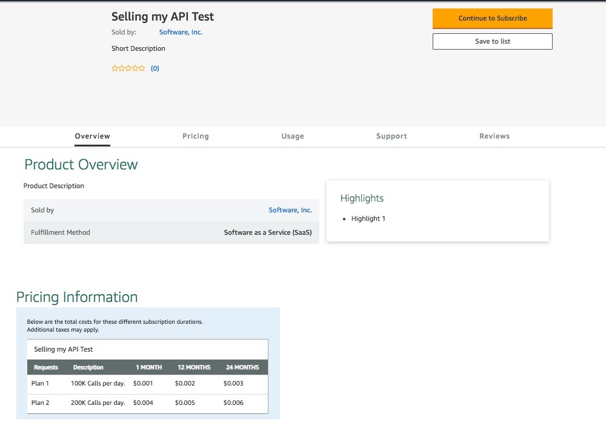

---
sidebar_position: 3
---

# Selling your API Management APIs through an Online Store

<head>
  <meta name="guidename" content="API Management"/>
  <meta name="context" content="GUID-b0a3f4f4-9b5b-4bc8-905a-922564705ce2"/>
</head>

For now, the API Marketplace feature supports AWS Marketplace. To sell your API Management API on AWS Marketplace, you'll need to:

## Procedure

1. Define, test, and publish your API Management product as an API listing with dimensions on AWS Marketplace. The listing is equivalent to API Management's "Package". The dimension is equivalent to API Management's 'Plan'. 

   :::note
   
   API Management is initially supporting **contract** listings only, which means "X dollars for Y API calls/day, for a term of Z months." 

   :::

2. Once you've created your listing, it should look similar to the following:

   

   |**Key** |**Quantity** |**Type** |**Purpose** |**Example** |
   | ----- | ----- | ----- | ----- | ----- |
   |ProductCode |1 |string |This uniquely identifies the customer's AWS Marketplace listing. |ebv4yfemqz7p0ks2m2rvphm4a |
   |DimensionCode |N |string |This uniquely identifies each dimension, within the context of the customer's AWS MP Listing. |plan1 |
   |Description |N |string |
The description will cite the quota, rate limits and/or throttles the customer is offering in each listing dimension. 

:::caution

This raw string cannot be synchronized programmatically and the customer must ensure that the advertised quota, rate limit and/or throttle described is configured identically at the plan level.

::: 
|100 calls/day |

1. Configure your AWS Marketplace account to give API Management the ability to interact with your AWS Marketplace listing. This is done using AWS CloudFormation to create an AWS Stack using API Management AWS CloudFormation templates. For more information, see [Configuring Your AWS Marketplace Account](Configuring_your_aws_marketplace_account.md). 

2. Assuming you already have a Package and Plan(s) configured within API Management, you then visit the API Marketplace page (**Design > API Marketplace**), create a listing. For more information, see [Adding Your First API Marketplace Listing](Addingyourfirstapimarketplacelisting/Adding_your_first_api_marketplace_listing.md). 
