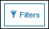

# Searching and Filtering Applications

<head>
  <meta name="guidename" content="API Management"/>
  <meta name="context" content="GUID-ef86a3cc-ac4c-4782-8a5b-c37ba5395125"/>
</head>

## Searching Applications

The Search functionality performs partial or complete string matches for the data in the specified columns. Instead of navigating through the user list on all pages, the following Applications attributes can be used as search filters to refine the user list: 

- Name 

- Description 

- Application Type 

- Usage Expected 

- Tags 

- Preferred Protocol 

- Preferred Output

- URL 

- Is Packaged 

**To perform a search:**

1. Select one or more fields from the **All Fields** list.

2. Enter text in the **Search** box. 

   The Search functionality searches for the specified text (partial or complete match) in the selected fields. 

3. Click . 

   On the **Applications** page, the Applications records that contain the specified search text for the selected fields are displayed. 

## Filtering Applications

Filter performs exact string matching for all the specified filter attributes.

**To apply a filter:**

1. Click . 

   The **Filter** pop-up window is displayed.

2. Select an attribute from the **Show items where** list.

3. Enter filter string in the field.

4. Click  to add the attribute to the filter list.

   :::note
   
   You can specify up to five attributes. 

   :::

5. Click **Apply**. 

   The Applications list on the **Applications** page is filtered according to the attributes specified. 

