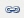

---
sidebar_position: 4
---

# Inserting and Editing Links

<head>
  <meta name="guidename" content="API Management"/>
  <meta name="context" content="GUID-16a94273-1f1b-4a7b-a06a-34ab220addca"/>
</head>

The **Insert/edit link** command () allows you to configure a link. When you click the **Insert/edit link** command, the **Insert/edit link** dialog box opens. 

The **Insert/edit link** dialog box contains following tabs: 

- **General**

- **Popup**

- **Events**

- **Advanced**

## General Tab

General link properties can be set on the **General** tab.

The following table describes the fields on the **General** tab. 

|**Field** |**Description** |
| -------- | --------- |
|Link URL|URL of a link. The file URL can be browsed by clicking **Browse**. |
|Anchors|The anchor on the page where the link navigates to. The anchors are inserted or edited using the Insert/edit anchor command. |
|Target|
Target of the link: 

- **Open in this window/frame:** The linked page opens in the current window/frame. 

- O**pen in new window:** The linked page opens in a new window. 

- **Open in parent window/frame:** The linked page opens in the parent window/frame. 

- **Open in top frame:** The linked page opens in the topmost frame. 
|
|Title|The link name, which is displayed when a user rests the mouse pointer on the link. |
|Class|The class in a style tag or style sheet file that describes how a link is displayed on screen. |

## Popup Tab

The JavaScript popup properties can be set on the **Popup** tab.

The following table describes the fields on the **Popup** tab. 

|**Field** |**Description** |
| -------- | -------- |
|JavaScript popup|Setting that enables all options on the tab. |
|Popup URL|Pop-up window URL. |
|Window Name|Pop-up window name. |
|Size|Size of the pop-up window measured in pixels. |
|Position (X/Y)|Position of the pop-up window on the screen. |
|Options|
The following settings apply for the pop-up window: 

- Show location bar 

- Show menu bar 

- Show toolbars 

- Show status bar 

- Show scrollbars 

- Make window resizable 

- Dependent (Mozilla/Firefox only) 

- Insert 'return false' 
|

## Events Tab

The Events tab allows you to assign events to certain inputs for a link. 

## Advanced Tab

Advanced link properties can be set on the **Advanced** tab.

The following table describes the fields on the **Advanced** tab. 

|**Field** |**Description** |
| -------- | -------------- |
|Id|The Link ID that is used as a reference for scripting and style sheets. |
|Style|Link style in the CSS. |
|Classes|Link class in the CSS. |
|Target name|The name of the window where the linked file loads. |
|Language Direction|
Direction in which the link is spelled. 

:::note

Setting the language direction from right to left is supported only if the character set supports right to left display.

::: 
|
|Target Language|Language of the resource in the target URL. |
|Language Code|Language code of the resource in the target URL. |
|Target character encoding|Character encoding of the target URL. |
|Target MIME type|File type of the target URL. |
|Relationship page to target|
The relationship between the current page and the target URL (web resource). 

:::note

This option with the value nofollow, is used by Google to specify that the Google search spider should not crawl the linked page.

::: 
|
|Relationship target to page|The relationship between the target URL and the current page. |
|Tabindex|The position of the current element in the tabbing order of the document. |
|Accesskey|Shortcut keys for the link. |

