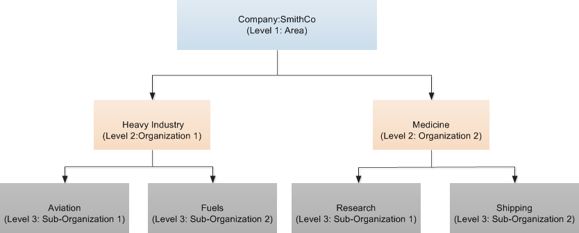
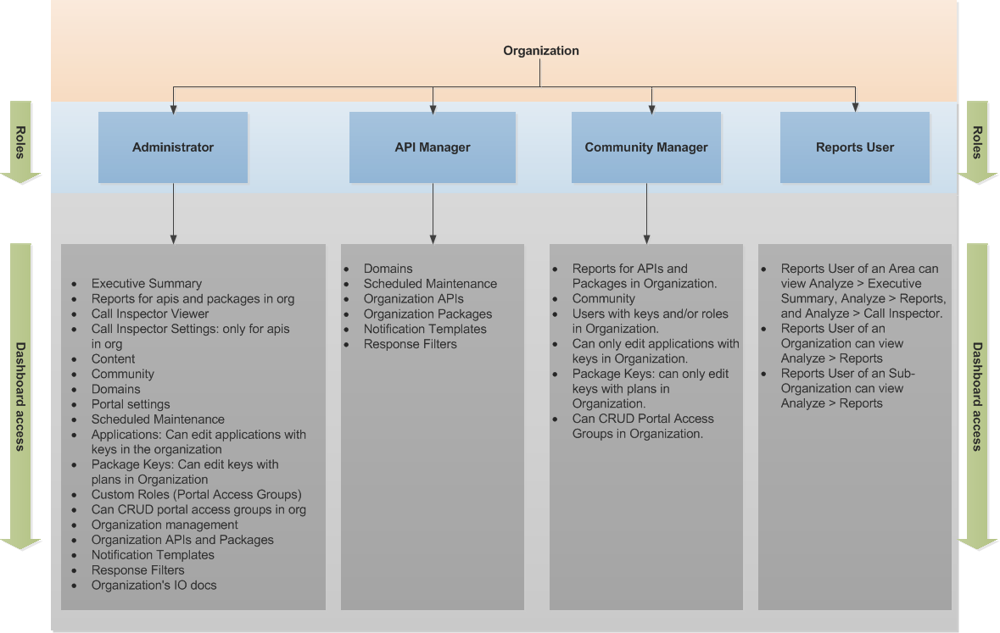
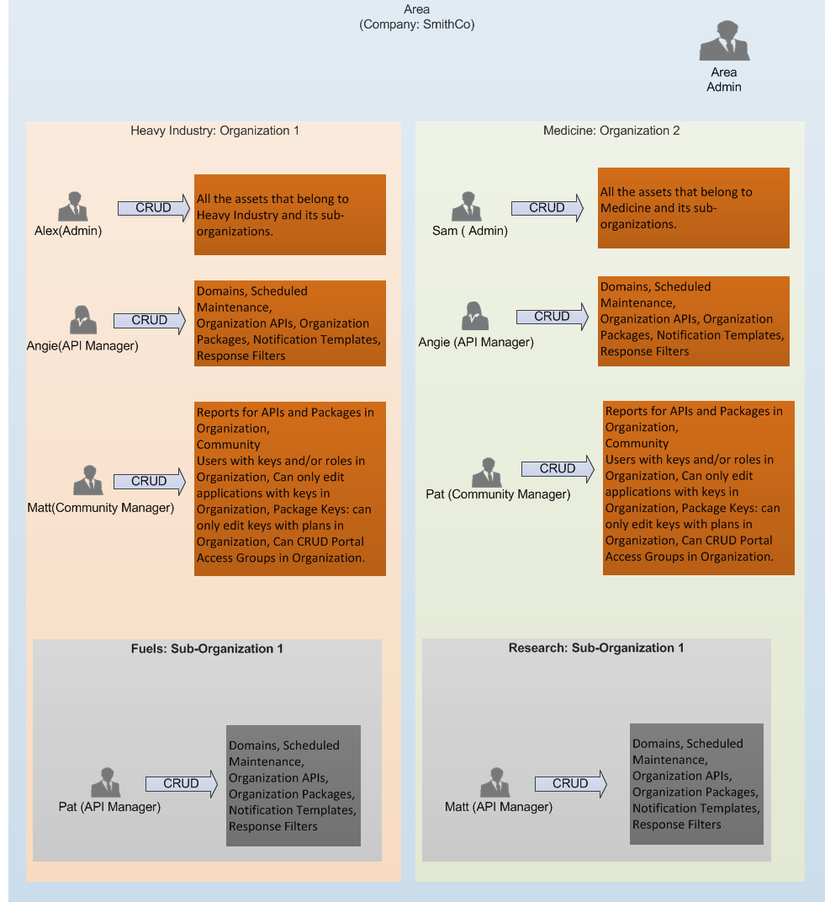
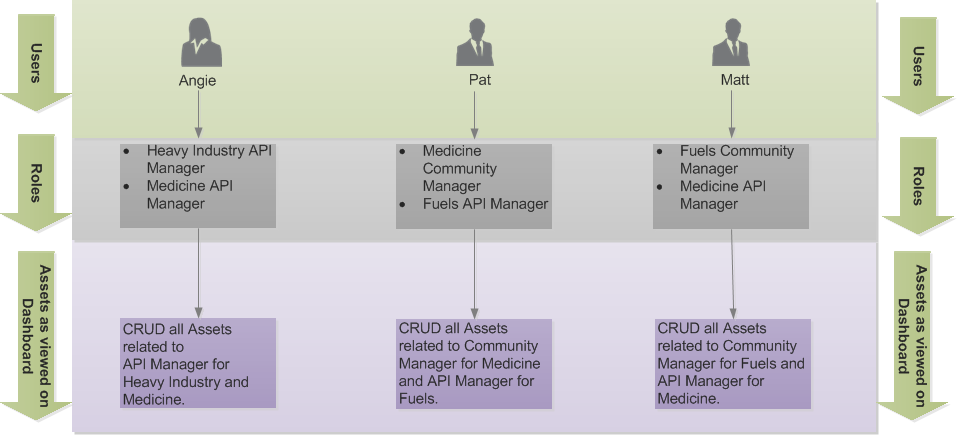

---
sidebar_position: 1
---

# Organizations

<head>
  <meta name="guidename" content="API Management"/>
  <meta name="context" content="GUID-b77b8abd-b35c-4e30-ab8b-ef6cfe1bb1a6"/>
</head>

## Organization Hierarchy

**Level 1: Area**

Area is a primary container that has Organizations and Sub-Organizations. Area signifies a company that has business units. For example, SmithCo is a company. SmithCo is an Area that is a container for Organizations and Sub-Organizations. 

**Level 2: Organizations**

Organization signifies a larger business unit of a company. Organization is a container for assets, Portal Access Groups, roles, and Sub-Organizations. For example, let us assume there is company SmithCo and it has business units Heavy Industry and Medicine. 

**Level 3: Sub-Organizations**

Sub- Organization signifies departments in a business unit. In this scenario, Heavy Industry is the Organization and it has two Sub-Organizations as there are two departments: Sub-Organization 1 is Aviation and Sub-Organization 2 is Fuels. Medicine is the Organization and it has two Sub-Organizations as there are two departments: Sub-Organization 1 is Research and Sub-Organization 2 is Shipping. 

:::note

You can only have two-level Organizational hierarchy: Organization and Sub- Organization. You cannot create a child for a Sub-Organization. 

:::

## Relationship Diagram

When an Organization is created, the following three roles are created: 

- Administrator 

- API Manager

- Community Manager 

- Reports User 

:::note

When the Organization or a Sub-Organization is created only above three roles are available to assign to the users. But after assigning the roles to the users, one could be an Administrator of a parent Organization or a Sub-Organization; or, an API Manager of a parent Organization or a Sub-Organization. Area Administrator is not assigned through the Control Center Users. 

:::

The following table describes the functionality of the users after roles are assigned to them. 

|**Role** |**Description** |
| -------- | ----- |
|Area Administrator|On the Dashboard, can view and modify all the resources on the Dashboard within the Area, Organizations, and Sub-Organizations and can create Organizations; Sub-Organizations; and Portal Access Groups for Organizations and Sub-Organizations. |
|Organization Administrator|On the Dashboard, can view and modify all the resources on the Dashboard within the Organizations and Sub-Organizations and can create Sub-Organizations and Portal Access Groups for the Organizations and Sub-Organizations. |
|Sub-Organization Administrator|On the Dashboard, can view and modify all the resources on the Dashboard within the Sub-Organization and can create Portal Access Groups for Sub-Organizations. |
|Organization API Manager|On the Dashboard, can view and modify API Definitions, Packages, Domains, Notification Templates, Response Filters, and Scheduled Maintenance for the Organization and its Sub-Organizations. |
|Sub-Organization API Manager|On the Dashboard, can view and modify API Definitions, Packages, Domains, Notification Templates, Response Filters, and Scheduled Maintenance for a Sub-Organization. |
|Organization Community Manager|On the Dashboard, can view and modify Reports for APIs and Packages, Community, Users with keys and/or roles, Applications, Package Keys, and add users to Portal Access Groups in an Organization and its Sub-Organizations. |
|Sub-Organization Community Manager|On the Dashboard, can view and modify Reports for APIs and Packages, Community, Users with keys and/or roles, Applications, Package Keys, and add users to Portal Access Groups in a Sub-Organization. |
|Area Reports User|On the Dashboard, can view Reports of Services and Packages that are owned by an Area, all the Organizations, and Sub-Organizations. |
|Organization Reports User|On the Dashboard, can view only those Reports of Services and Packages that are owned by the Organization to which the Reports User belongs to and can also view the Reports of Services and Packages that are owned by its Sub-Organizations. |
|Sub- Organization Reports User|On the Dashboard, can view only those Reports of Services and Packages that are owned by the Sub-Organization to which the Report User belongs. |

The Area Administrator and Organization Administrator assigns the Organization users to one or multiple roles. For example, a user can be assigned to the Administrator and the API Manager roles. Based on the roles, the users can view their Organization's Control Center resources on the Dashboard. 

Let us consider the following example for Organization Roles:

In the above example, Angie, Pat, and Matt are the users who belong to different Organizations and Sub-Organizations. Based on the roles, these users will view specific assets on the Control Center Dashboard and can perform CRUD operations accordingly. The following diagram explains role-based Control Center visibility for Angie, Pat, and Matt.

