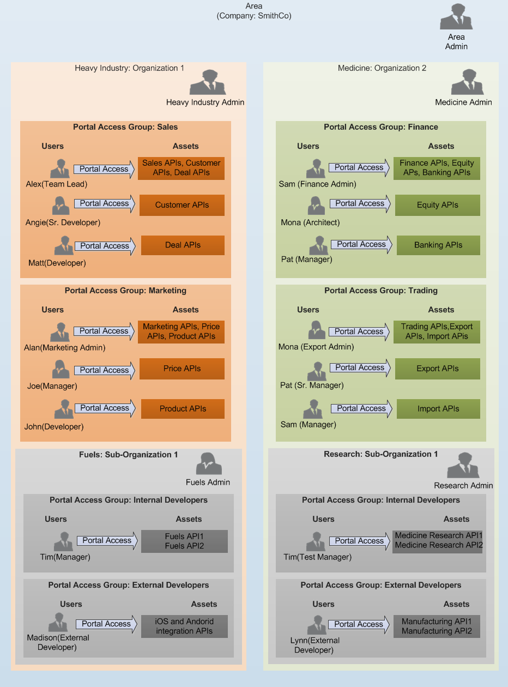
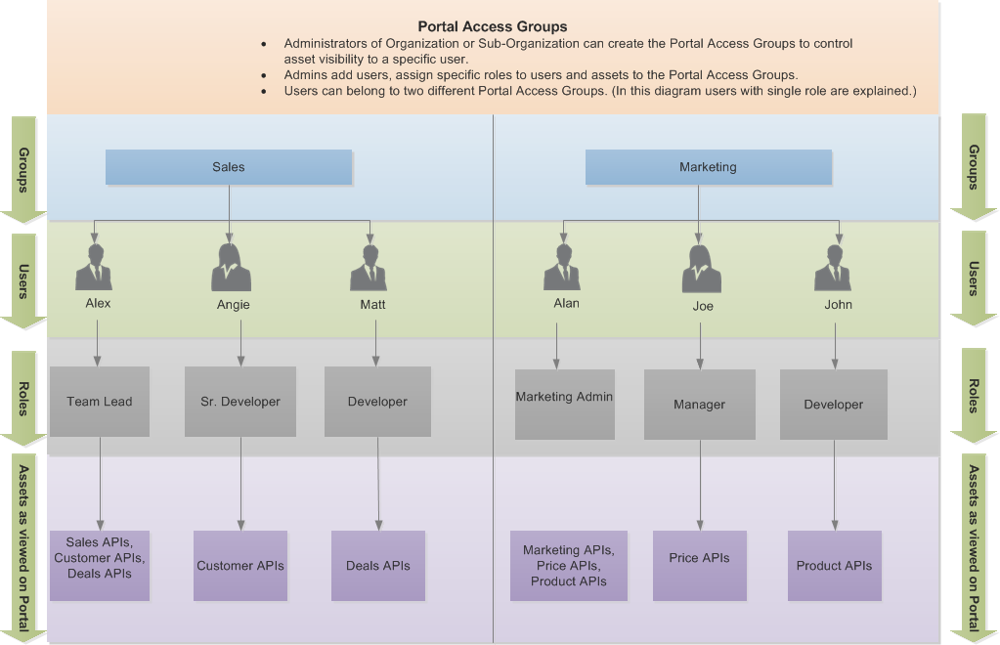
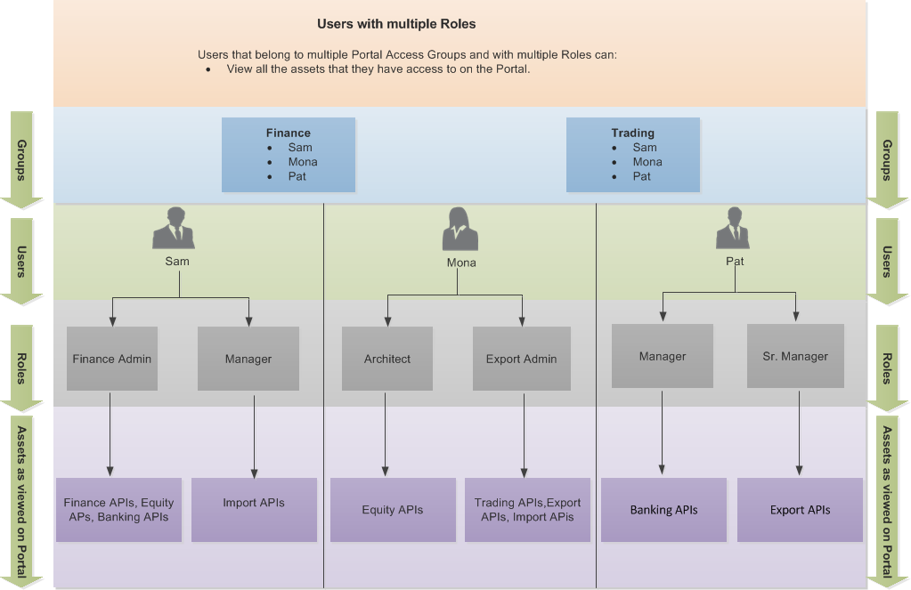
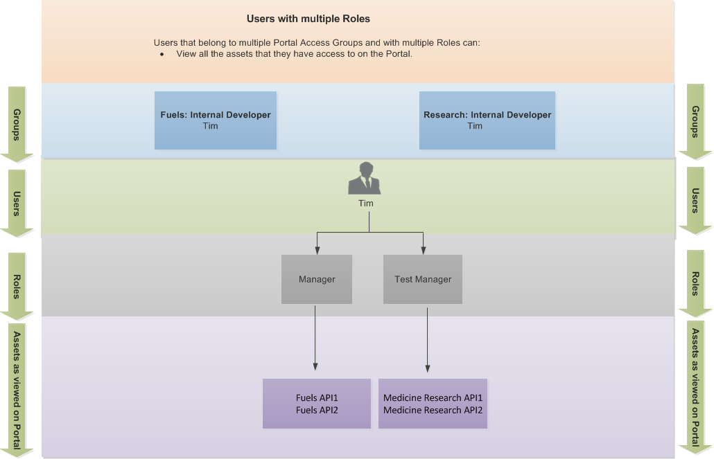

---
sidebar_position: 1
---

# Portal Access Groups Introduction

<head>
  <meta name="guidename" content="API Management"/>
  <meta name="context" content="GUID-392ae0ea-4f47-4e98-8a9b-0f743a7ea0f5"/>
</head>

The Portal Access Group is a group of Control Center resources (Plans and Interactive Documentation) and Portal Users (developers). You can use Portal Access Groups to provide role-based user access to resources on your Portal. The users in a specific Portal Access Group have access only to the resources in that Portal Access Group. The users can request Package Keys for API Package and Plans on the Developer Portal that are in the Portal Access Group. 

The Administrator and the Community Manager can create Portal Access Groups according to: 

- **Area:**

  - **An Administrator:** can create and modify all the Portal Access Groups of all the Organizations and Sub-Organizations and can add or remove users, Plans, and Interactive Documentation that belong to specific Organizations and its Sub-Organizations to the Portal Access Groups. 

  - **A Community Manager:** can create new Portal Access Groups and add or remove users in the Portal Access Groups of specific Organizations and its Sub-Organizations. 

- **Organization:** 

  - **An Administrator:** can create and modify only the Portal Access Groups owned by the Organization and its Sub-Organizations and can add or remove users, Plans, and Interactive Documentation that belong to the Organization and its Sub-Organizations to the Portal Access Groups. 

  - **A Community Manager:** can create new Portal Access Groups and add or remove users to the Portal Access Groups of specific Organizations and its Sub-Organizations.

- **Sub-Organization:** 

  - **An Administrator:** can view and modify only the Portal Access Groups owned by the Sub-Organization and can add or remove users, Plans, and Interactive Documentation that belong to the Sub-Organization to the Portal Access Groups.

  - **A Community Manager:** can create new Portal Access Groups and add or remove users to the Portal Access Groups of the Sub-Organization. 

:::note

The API Manager does not have access to the Portal Access Groups page. 

:::

Let us see the following example for a Portal Access Group. 

## Users and Portal Access Group

- Users may belong to a single Portal Access Group in the same Organization. 

- Users may belong to multiple Portal Access Group in the same Organization. The users can then view the APIs (on the Developer Portal) in the multiple Portal Access Groups. 

- Users may belong to a multiple Portal Access Groups of different Organizations. The users can then view all the APIs (on the Developer Portal) in the multiple Portal Access Groups. 

## Users with Single Role in the same Organization

In the Portal Access Group diagram, Heavy Industry has two Portal Access Groups: Sales and Marketing. The following diagram shows how each user can view the assets on the Portal based on the role assigned.

## Users in multiple Portal Access Group in same Organization

In the Portal Access Group diagram, Medicine has two Portal Access Groups: Finance and Trading. The following diagram shows how each user can view the assets on the Portal based on the role assigned.

## Users who belong to multiple Portal Access Group in multiple Organizations

In the Portal Access Group diagram: Tim belongs to two Portal Access Groups of two different sub-organizations: Internal Developer in Fuels and Internal Developer in Research.

