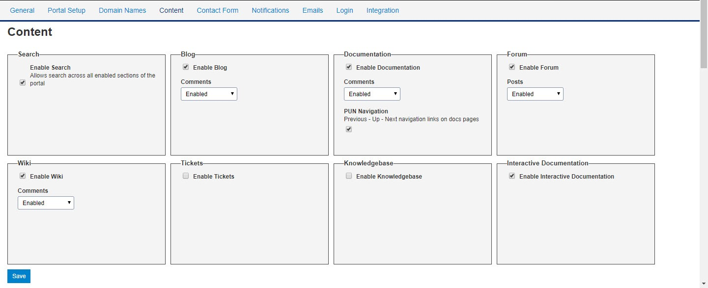
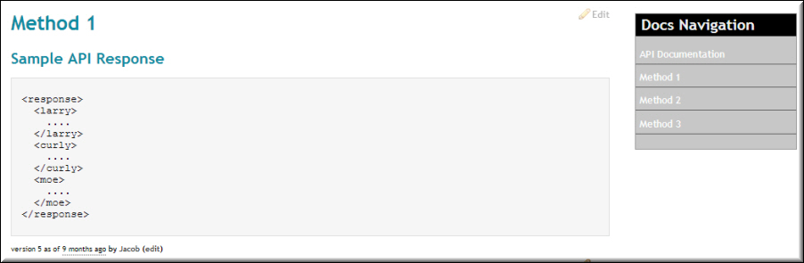
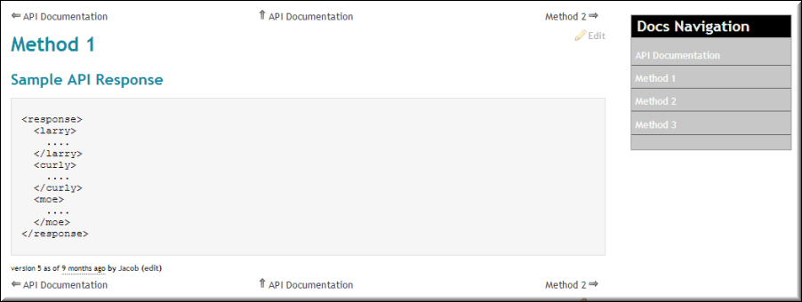

---
sidebar_position: 5
---

# Content (Portal)

<head>
  <meta name="guidename" content="API Management"/>
  <meta name="context" content="GUID-000997e7-05be-48b2-8a18-9cf27e3221d8"/>
</head>

Administrators can use the **Content** tab to enable or disable features within the Portal application such as **Search, Blog, Documentation, Forum, and Interactive Documentation**. For those sections that allow user-generated content, such as **Documentation and Forums**, moderation levels can be specified; these settings are applicable only to the registered users. Anonymous users can only browse the Portal and cannot create forum topics or add comments.

## Search

It allows you to enable search on the Portal by selecting the check box in the **Search** panel. After you enable search, the **Search** button is displayed on the Portal and content created within the Content tab must be searchable. 

## Blog

It allows you to enable the **Blog** tab on the Portal by selecting the check box in the **Blog** panel. After the blog is enabled, the Blog tab is displayed on the Portal page. You can also specify settings for user-generated comments in the **Blog** section. 

The following table explains the settings for the comments. 

|**Setting** |**Description** |
| ---------- | ----------- |
|Enabled|The users can insert comments in the section. |
|Moderated|The comments submitted by the users in the section are held for administrator's approval. Administrator can view the moderated comments in the **Community** section and decide to approve or reject. After approval, the comments are displayed in the Portal. |
|Moderated Spam|The comments submitted by the users are automatically checked for any spam content present. If Spam is found in a comment, the comment is held for administrator's approval. The Administrator can view the moderated comments in the **Community** section. After approval, the comments are displayed in the Portal. |
|Locked|The users cannot submit comments in the section if the option Locked is selected. The message *New comments are not being accepted at this time* is displayed to users. |
|Disabled|The users cannot submit comments in the section. |

## Documentation

Selecting the **Enable Documentation** check box displays the **Documentation** tab on the Portal. You can also specify comments settings for the **Documentation** tab. For more information on comment settings, see the table in the **Blog** section. 

By selecting the **PUN Navigation** check box in the **Documentation** panel, the navigation links can be displayed on the Portal. 

For PUN Not Enabled, the following screen shot displays the documentation page without navigation links.

For PUN Enabled, the following screenshot displays the documentation page with navigation links.

For information on creating documentation, refer to the [Content](../Contentoverview/Content.md) section. 

## Forum

Selecting the **Enable Forum** check box displays the **Forum** tab on the Portal. You can also specify comments settings for the **Forum** tab. For more information on comment settings, see the table in the Blog section.

## Interactive Documentation

Selecting the Enable Interactive Documentation check box displays the Interactive Documentation tab on the Portal. For more information, refer to the [Interactive Documentation](../../DesignControls/Interactivedocumentation/Interactive_documentation.md) section.

## File Manager

The **File Manager** feature can be used to upload files within the CMS. This option prevents users from uploading files through the **File Manager** feature within the CMS, if not selected. 

:::note

The following features in the **Content** tab are deprecated and visible in the Dashboard only for legacy support. 

- Wiki

- Tickets 

- Knowledge Base

It is recommended that you do not enable these features. If you have questions, please contact API Management Support.

:::

