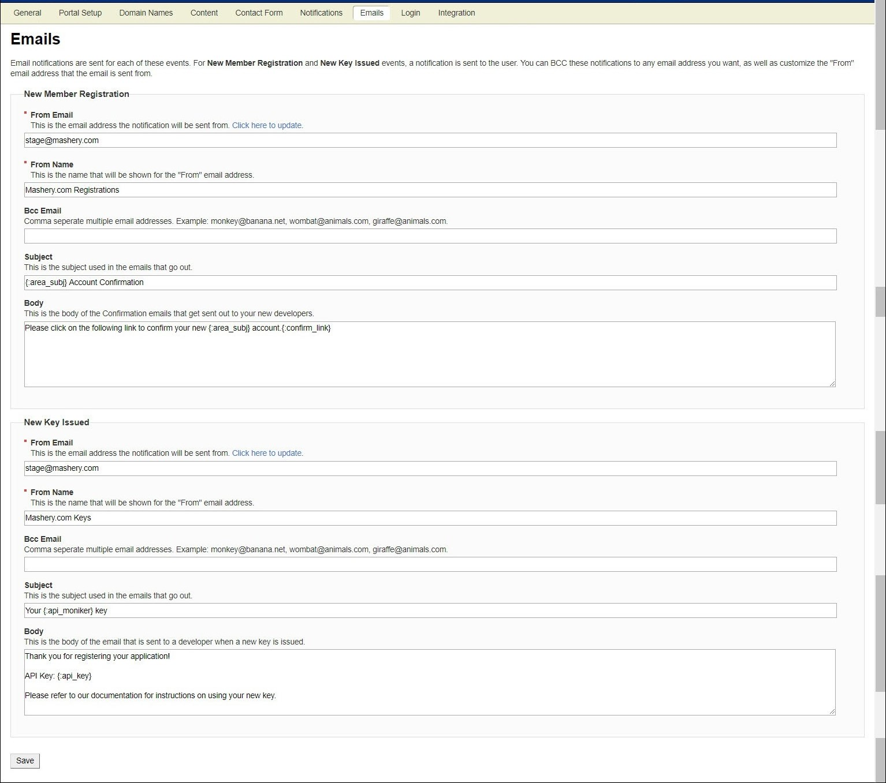

---
sidebar_position: 1
---

# Emails

<head>
  <meta name="guidename" content="API Management"/>
  <meta name="context" content="GUID-147cba41-5007-4408-b86a-5deee2af48ce"/>
</head>

The API Management Portal sends email notifications to users under various circumstances. You can configure the settings of email notifications for the following: 

- [New Member Registration](New_member_registration.md)

- [New Key Issued](New_key_issued.md)

