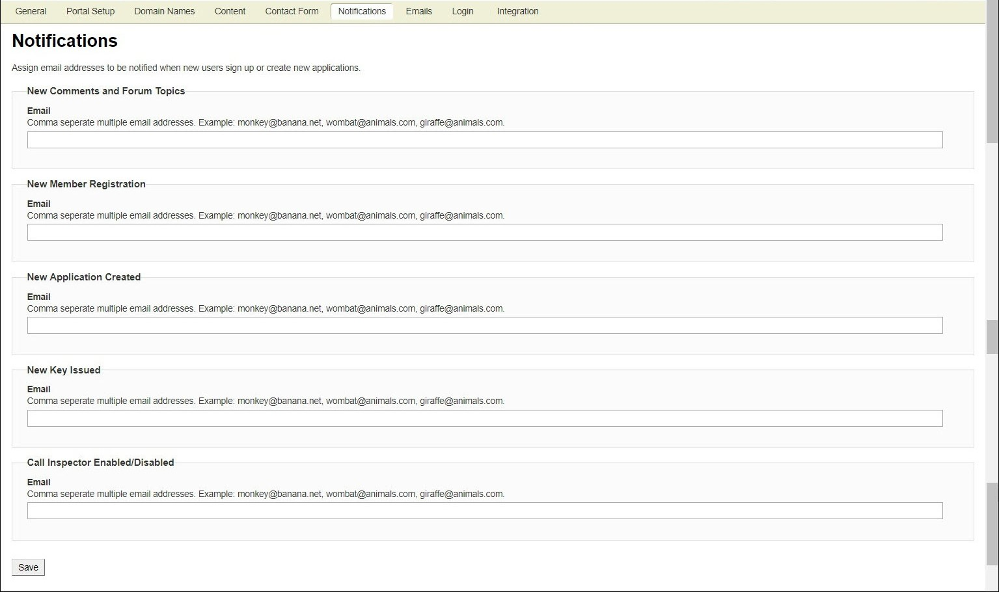

---
sidebar_position: 7
---

# Notifications (Portal)

<head>
  <meta name="guidename" content="API Management"/>
  <meta name="context" content="GUID-22f4cc5b-c371-429a-8fd3-d0ec14d18ef1"/>
</head>

The Traffic Manager sends an email notification when: 

- a new comment or forum topic is created on the Portal 

- a new developer registers with the Portal 

- a new application is created 

- a new key is issued to a developer 

- [Call Inspector](../../AnalyzeControls/Callinspector/Call_inspector.md) is enabled or disabled 

:::note

For multiple recipients, use comma separated email addresses. For example, John@demo3.com, Jacob@demo3.com, Anne@demo3.com. 

:::

