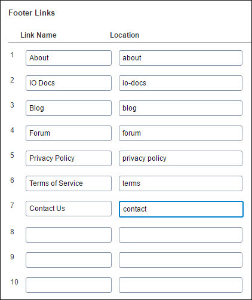
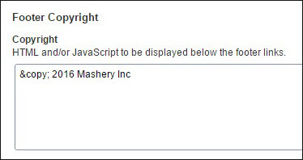
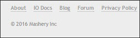

---
sidebar_position: 8
---

# Footer

<head>
  <meta name="guidename" content="API Management"/>
  <meta name="context" content="GUID-1e40eb8f-4afb-4ed4-bb3b-82ed1ff6763a"/>
</head>

## Footer Links

The footers on all pages can have links to other pages. You can add up to 10 links in the footer.

This following table describes the columns in the **Footer Links** section. 

|**Column** |**Description** |
| --------- | ------ |
|Link Name|The link name that appears in the footer. |
|Location|The URL of a page. |

## Footer Copyright

The copyright notice for the Portal can be added in the **Footer Copyright** section. The copyright notice is displayed in the footer of all Portal pages.

