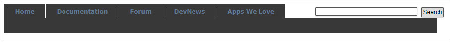
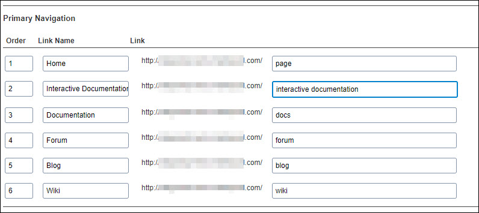
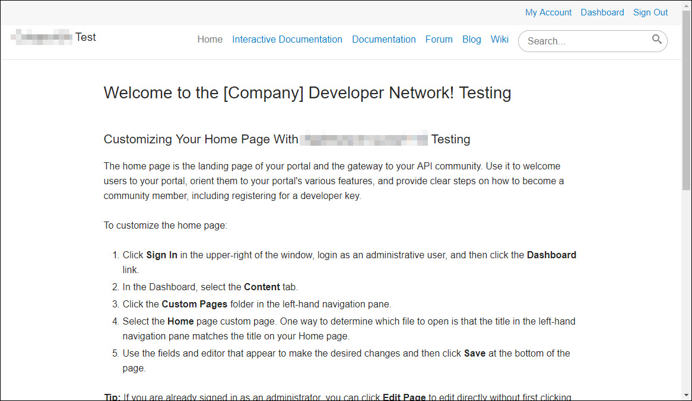

---
sidebar_position: 7
---

# Primary Navigation

<head>
  <meta name="guidename" content="API Management"/>
  <meta name="context" content="GUID-38db2bd6-3b26-4728-a953-2adf88fa8cb9"/>
</head>

The **Primary Navigation** section allows you to add links that are displayed as tabs in the Portal view pages by default or provide additional links to pages within the domain using custom CSS and JavaScript. The order for the pages, link names and paths for the pages to be linked can be set. You can add up to six links. 

The following table describes the columns in the **Primary Navigation** section. 

|**Column** |**Description** |
| --------- | ------------- |
|Order|The order of each link or page on the Portal. |
|Link Name|
The tab name that appears on the Portal after it is set in the Primary Navigation section. The links can be named as per the Portal nomenclature. 

The following are the types of links that can be added: 

- **Blog:** Links to blog pages. 

- **Documentation:** Links to documentation pages. 

- **Forum:** Links to forum pages. 

- **Wiki:** Links to Wiki pages. 

- **Custom Page:** Links to custom pages that are created in the **Content** tab. 
|
|Link|
The URL for the respective page. You must enter the exact path of the page to complete the link. 

The following types of links can be used in a Portal: 

- Link to the default pages such as documentation, blog, forum, and Interactive Documentation. 

&emsp;For example – `http://demo3.mashery.com/blog` 

- Custom pages that are within the Portal domain. 

&emsp;For example – `http://demo3.mashery.com/page/News` 

- Any page in the Portal domain that can be accessed, can be included in the primary navigation. 
|

## Example of Link Names

The following image displays the link names, their order and the paths specified.

## Example of External View of Developer Portal

The following image displays these navigation links as set in the **Portal setup** tab, in the Portal itself, that is, how the developer would see them.

If link name and path are not entered, the tab is not displayed. A page can be accessed by entering the path in the address bar. 

