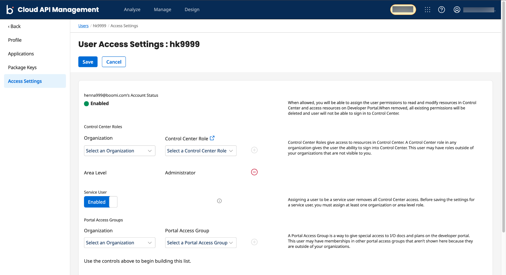

---
sidebar_position: 8
---

# Adding Service User Role

<head>
  <meta name="guidename" content="API Management"/>
  <meta name="context" content="GUID-34a6a568-896a-431c-9860-0b590a7bae55"/>
</head>

A **Service User** is a Control Center role that only allows service level access to Boomi Cloud API Management. You can assign Service User role with at least one additional area-level role to the Boomi Cloud API Management user.

:::note

For Boomi Platform-enabled areas, you cannot assign Service User role in API Control Center to Platform users. 

:::

## Procedure

1. Log into API Control Center with a user that has Admin rights to create users. 

2. Click **Manage>Users**. The Manage your Users page is displayed.

3. Click **New User**. The New User page appears. Enter values for the mandatory fields, and then click **Save and Continue**. This opens **User Access Settings** page.

4. In the **Control Center Roles**, provide the following values:

    a. In **Organization**, select **Area Level** from the drop-down list.
  
    b. In **Control Center Role**, select **Administrator** from the drop-down list.

    c. Click  to add a role.
    
      :::note
    
      You must assign at least one organization or area level role along with a Service user role before assigning a Service user role.
    
      ::: 

5. Click the **Enabled** toggle switch to assign a Service User role.

    :::info

    Adding a **Service User** role to a user removes all other administrative roles after the setting is saved. As a result, the user can no longer log in to Boomi Cloud API Management.

    :::

    

6. Click **Save**, then **Confirm** in the pop-up window, to assign the **Service User** role to the newly-created user.
