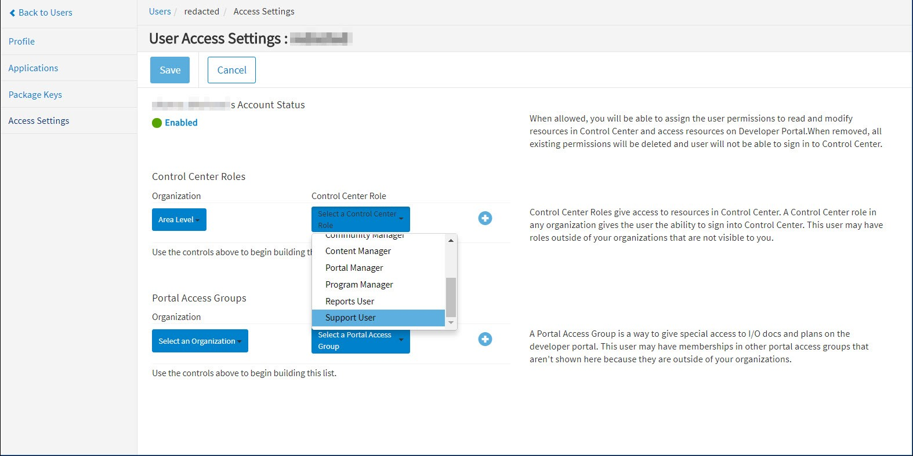

---
sidebar_position: 9
---

# Adding Support Users

<head>
  <meta name="guidename" content="API Management"/>
  <meta name="context" content="GUID-9a687b76-d49a-46fa-814c-c89c5761a1dc"/>
</head>

A support user is a Control Center role that gives read-only access to all pages in the API Control Center dashboard. Buttons (such as **Save, Create, Edit,** and **Delete**) and various fields (such as checkboxes and text boxes) are disabled for support users. 

:::note

Legacy pages are not shown to support users. 

:::

## Procedure

To add a Support User:

1. Log into API Control Center with a user that has Admin rights to create users. 

2. Go to the Manage > Users tab. 

3. For a new user, create a **New User** with the necessary fields, then click **Create**, which opens the **User Access Settings** page. 

4. In the **Control Center Roles** section, select **Area Level** for **the Organization**, and **Support User** as the **Control Center Role**.

   

5. Click **Save** to assign the **Support User** role to the newly-created user. 
