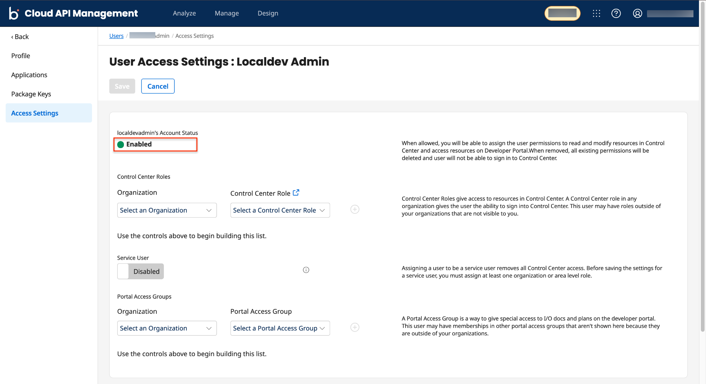
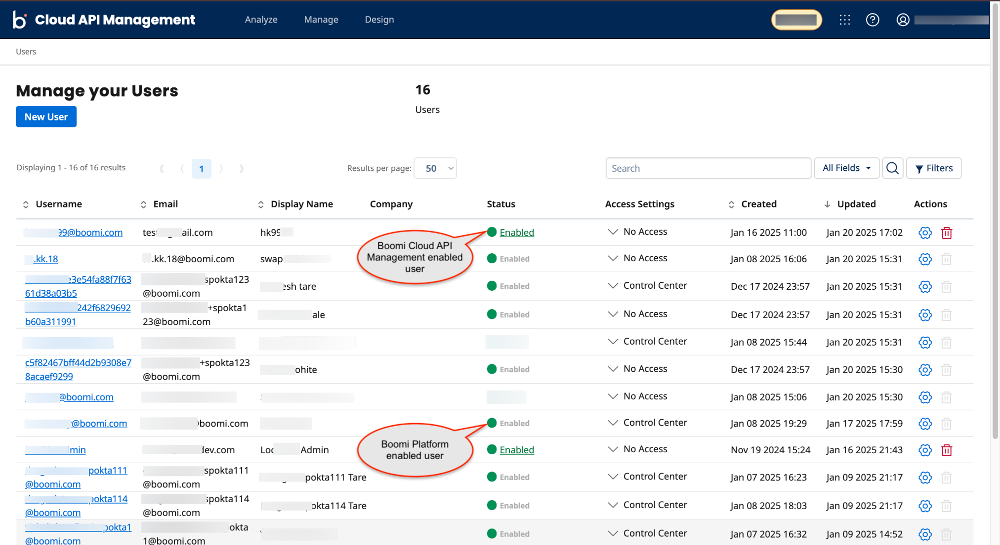

---
sidebar_position: 5
---

# Enabling or Disabling User Access

<head>
  <meta name="guidename" content="API Management"/>
  <meta name="context" content="GUID-bc4fba87-e460-49b6-9ff8-7d99ad51e47e"/>
</head>

The users can be enabled or disabled on the Users page.

If a user is disabled: 

- The users cannot access own accounts.

- The user's Package keys are disabled, and the user cannot have API access. 
:::note

- Boomi Cloud API Management users **can enable or disable users** from the [Manage your Users](#enabling-or-disabling-users-from-manage-your-users-page) or [User Access Settings](#enabling-or-disabling-users-from-user-access-settings-page) page.

- Boomi Enterprise Platform users **cannot enable or disable users** from the **Manage your Users** or **User Access Setting** page, as enabling or disabling accounts is managed via the Boomi Enterprise Platform. By default, the **Enabled** status is assigned to all the newly created users in Boomi Enterprise Platform.

:::

You can enable or disable the user access by one of the following ways:

## Enabling or Disabling users from User Access Settings page

1. Click **Manage>Users**. The Manage your Users page is displayed. 

2. In the Username column, click on the username. The User Access Settings page for that user is displayed.

3. In **Account Status** field click the **Enabled** or **Disabled** link to enable or disable the user access. 
  
    :::warning

    You cannot change the Account Status field for the Platform user.

    :::

    

4. Click **Save**. The status of the user is changed. 

## Enabling or Disabling users from Manage your Users page

1. Click **Manage>Users**. The Manage your Users page is displayed. 

2. In the Status column click the **Enabled** or **Disabled** link to enable or disable the user access.

    :::note

    This link is not available for the Boomi Enterprise Platform users.

    :::

    