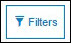

---
sidebar_position: 3
---

# Searching and Filtering Users

<head>
  <meta name="guidename" content="API Management"/>
  <meta name="context" content="GUID-ff0e5353-820d-4347-aa40-58cecba79c00"/>
</head>

## Searching Users

The Search functionality performs partial or complete string matches for the data in the specified columns. Instead of navigating through the user list on all pages, the following user attributes can be used as search filters to refine the user list: 

- Username 

- Email 

- Display Name 

- First Name 

- Last Name 

- Website 

- Phone 

- Company

- City or Locality 

- State, Province, or Region 

- Zip Code or Postal Code 

- Country Code 

**To perform a search:**

1. Select one or more fields from the **All Fields** list.

2. Enter text in the **Search** box. 

   The Search functionality searches for the specified text (partial or complete match) in the selected fields. 

3. Click . 

   The user records, on the **Users** page, are filtered for the selected fields that contain the specified search text. 

## Filtering Users

Filter performs exact string matching for all the specified filter attributes. 

**To apply a filter:**

1. Click . 

   The Filter pop-up window is displayed.

2. Select an attribute from the **Show items where** list.

3. Enter a filter string in the field.

4. Click  to add the attribute to the filter list.

   You can specify up to five attributes. 

5. Click **Apply**. 

   The User information on the **Users** page is filtered according to the attributes specified. 

