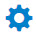

# Users

<head>
  <meta name="guidename" content="API Management"/>
  <meta name="context" content="GUID-9f32b5e9-33c1-4ee9-bead-bb9842221d01"/>
</head>

The Users page displays all the registered users in your Boomi Enterprise Platform and Boomi Cloud API Management area, including the following: 

- The developers registered through the portal. 

- Users created through the Cloud API Management API. 

- Users generated as a part of the Single Sign-On (SSO) process, if enabled. 

- Company personnel and the administrators of your API program. 

To learn more about what user management tasks administrators can perform in the API Control Center, depending on whether you are a Boomi Cloud API Management user or a Boomi Enterprise Platform user, see [User Management](../../ManageControls/Users/User_management.md).

The **Users** page displays a navigable list of registered users. This list is paginated such that a large number of users are displayed in groups of 50, with each group being accessed by the navigation buttons in the lower part of the page. 

The following table describes the default fields displayed in the list view on the **Users** page. 

|**Field** |**Description** |
| ------- | -------- |
|Username|
The name of the user to log on to the application. 

This is the primary identifier for the user in the Boomi Cloud API Management system. The detailed information about each user can be viewed by clicking a user name. On the Users page, you can also manage roles, keys, and applications. 

:::note

The Username cannot be changed once the user is created, so including personal or private information is not recommended for privacy reasons.

::: 
|
|Email|The email address of the registered user. Multiple user can share the same email address. Hence, email is not a unique data field. |
|Display Name|The display name of a registered user. The detailed information about the users can be viewed by clicking the display name. |
|Company|The name of the organization where the user is employed. |
|Status|
The status of each user, which can be any one of the following: 

- **Waiting:** This indicates that the user confirmation is pending. It prevents users from logging on to the Boomi Cloud API Management Portal until the user is enabled. 

- **Disabled:** This indicates that the user is disabled. It prevents user from logging in to the Portal and implies the existing package keys are unworkable. 

- **Enabled:** This indicates that the user is active. 

To change the status, toggle between Enabled and Disabled. 

:::note

After changing the status from Waiting to Enabled or Disabled, you cannot change the status back to Waiting.

::: 
|
|Created|The date and time when the user was created. |
|Actions| |
||Click the icon to modify the settings of the user. |
||Click the icon to delete the user. |

