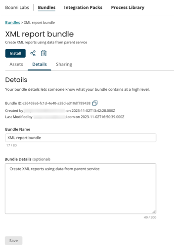

# Editing a Bundle 

<head>
  <meta name="guidename" content="Bundles"/>
  <meta name="context" content="65f83f01-05b5-40ff-8af1-240895502284"/>
</head>

The Bundle **Details** page provides a high-level overview of the contents of a Bundle. 
To edit the information of a Bundle:
1. Click on the Bundle name link and navigate to the **Details** tab.
2. The **Details** tab displays the following information:

    a. **Bundle ID** - The unique ID of the Bundle to identify the Bundle. Example: c4225ff6-c782-4dc5-9e85-876f5ec0e246. This ID can be used for troubleshooting when required.

    b. **Created by** - Information of the Bundle owner. This displays the creator of the Bundle and the date the Bundle was created.  The creator shows the user who created the Bundle if the logged-in account is the Bundle owner, otherwise, it shows the Publisher name for the account that created the Bundle.

    c. **Last Modified by** - Provides the last modification details. This displays who last modified the Bundle.  If the logged-in account is the Bundle owner, this shows the user who last modified the Bundle.  Otherwise, it shows the Publisher name for the account that last modified the Bundle.

    d. **Bundle Name** - The name of the Bundle. 

    f. **Bundle Details** - The description of the Bundle. 
3. Modify any information as required and click **Save**.

