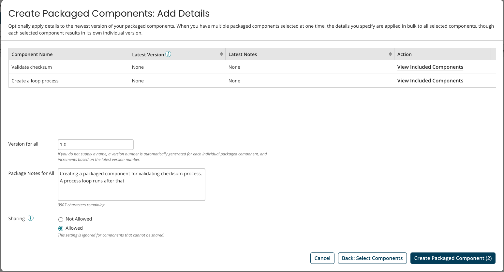

# Adding an Integration Asset 

<head>
  <meta name="guidename" content="Bundles"/>
  <meta name="context" content="cfb5bce2-29b9-4477-be29-d69c3d91aa7e"/>
</head>

Integrations are assets you can add to a Bundle. Adding Integrations to Bundles is the means to share Packaged Components with the user of the Bundle. Packaged Components are deployable “snapshots” of the Integrations you have built. See [Packaged Components](/docs/Atomsphere/Integration/Deployment/int-Packaged_components_094d4856-e4ed-4c20-b47a-87ae2e48542b.md) for more information.

To add an Integration asset to a Bundle:

1. Click on the Bundle name link to go inside the Bundle.
2. In the **Assets** tab, click **Add Asset**.
3. In the **Add Asset to Bundle** pop-up, select **Integration** from the **Select Asset Type** dropdown.
4. Select a **Packaged Component** from the Select Packaged Component Dropdown.

:::note

To add a Packaged Component to a Bundle, you must set the Packaged Component privilege to `Allowed` at the time of Bundle creation. Also, note that you do not need to deploy the Packaged Component before adding it to the Bundle.

:::

 

5. In the **Asset Name** field box, provide a name for your asset.
6. **Asset Description**  (Optional): Type a description for the asset in the asset description field.
7. Click **Next**.
8. Review the details of the Integration asset, and then click **Add to Bundle** to finish adding it.
