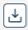

# Downloading a Custom Asset

<head>
  <meta name="guidename" content="Bundles"/>
  <meta name="context" content="63b4139c-f26d-4fa9-84b0-cc02da3ea67d "/>
</head>

It is possible to download a Custom asset that was added to a Bundle. A non-Bundle owner can also download a Custom asset created and added by other accounts.

To download a Custom asset:

In the **Assets** tab, select the Custom asset you want to download in the Bundle and click .

This downloads the asset to your local machine.
