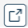

# Viewing an Asset

<head>
  <meta name="guidename" content="Bundles"/>
  <meta name="context" content="a3937e27-e86b-4276-9d85-66d104723073"/>
</head>

The view option lets you view the details of assets added to a Bundle. You can view details of assets that you have added and even those added by others. You can view details of an Integration asset and a Flow asset, whereas this option is unavailable for a Custom asset.

To view details of an Integration asset:
1. In the **Assets** tab, select the asset you want to view in the Bundle and click .

    The **Packaged Components** page opens in a new tab. 

2. View the details. 

