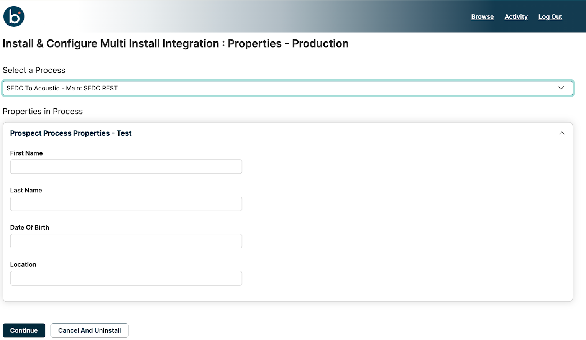
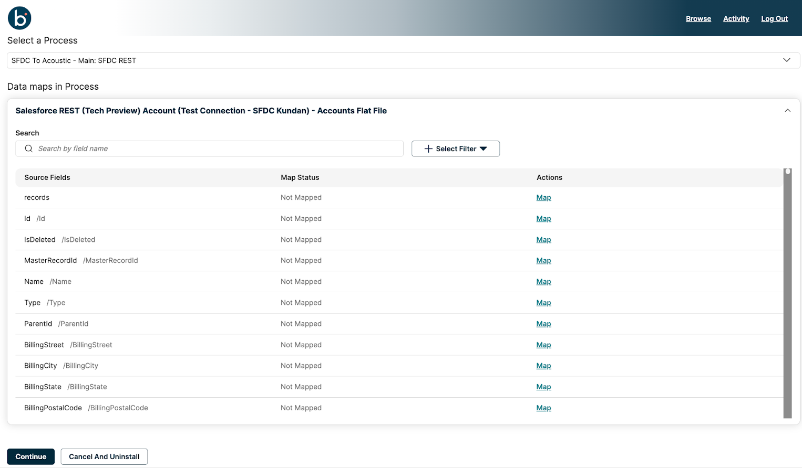

# Installing a multi install integration

<head>
  <meta name="guidename" content="Spaces"/>
  <meta name="context" content="GUID-f5c63a4f-a454-4d81-8301-d6a800271434"/>
</head>

Multi install integrations are integration packs that allow you to install multiple instances of the Integration per account.

## Installing ipacks

1. In the Spaces user portal, search for the integration you want to install. You can search for an integration by typing its name in the search bar on the Browse page.
2. Click **Install**.
3. Configure the following based on the integration pack configuration set by the Space Admin:
    * **Integration Name** —Type a name for the current instance of the integration.  
    * **Select Environment(s)** — Select a minimum of one or multiple environments to install your integration. 
    * **Use the same configuration in each selected environment** — If you want to use the same configuration in each environment, select **Yes**. Otherwise, select **No**.
:::note

 If you select multiple environments, you must choose whether you want the same or a different configuration in each environment. If you choose **yes**, all the extensible properties will have the same value. If you choose **no**, you can configure different configuration values for the extensible properties for each environment.

:::

4. Click **Continue** to go to the next tab.

5. Select the appropriate process you want to install from the **Select a Process** drop-down list.

## Configuring extensions

You can configure processes with one or more of the following extensions in the Spaces UI:

* Connections
* Connections with OAuth
* Process Properties
* Data Maps

### Connections

The Connections page displays the configuration settings for connections within an integration pack. Examples: Salesforce connector and HTTP Connector. 

:::note

Connection property fields vary based on the connector selected for the process.

 :::

On the Connections configuration page,  you can either update the fields associated with a connection to suit your requirement or leave them blank to use the default values. For more information, refer to
[Connectors](/docs/Atomsphere/Integration/Connectors/c-atm-Connectors_bb305b35-0f13-4937-a918-f85dbbe1b27b.md).

Perform the following steps on the Connections configuration page.

1. Add or update the pre-populated values for the Connections property fields.
    * **URL**: Enter the URL required to establish the connection.
    * **Username**: Enter the username for your connection.
    * **Password**: Enter the password for your connection.
2. Click **Continue** to go to the next page.

### Connections with OAuth

OAuth Connections, such as those for QuickBooks, utilize a two-step verification process to ensure secure connections. As an end user, you can directly generate Access Tokens within the Spaces UI to ensure a secure connection while using OAuth connectors.

Spaces support multiple processes, multiple connections (with or without OAuth), and multiple environment configurations, which allows you to install the integration pack with customized configurations. 

:::note

 Configure the connection properties for other environments if you have chosen the radio button to use different configurations in each selected environment during installation.

 :::

Prerequisites:

* Before you begin, you must create a company and add the redirect URI in the Identity Provider (IDP).
    * **Creating a company:**
        1.  Launch the [IDP](https://developer.intuit.com/) portal:
            Enter your IDP credentials to access the IDP homepage.
        2. Navigate to Sandboxes:
            Go to **My Hub** &gt; **Sandboxes** to create the company.
        3. Initiate Company Creation:
            Click the **Add** button on the homepage.
        4. Select Country:
            From the dropdown menu, select the country for the new company and click Create. The created company will now appear on the homepage.
            Find the Company ID associated with your new company displayed beneath its name for future reference.

    * **Adding a redirect URI:**
        1. Access Workspace:
            In the  [IDP](https://developer.intuit.com/) portal, navigate to **My Hub** &gt; **Workspace**.
        2. Select User Workspace:
            Click on your user workspace and select the respective app (company).
        3. Go to Settings:
            Navigate to the **Settings** page and find the **Redirect URIs**.
        4. Add Redirect URI:
            Click **Add URI** and enter the redirect URI in this format: &lt;Base URL&gt;account/&lt;Child Account ID&gt;/oauth2/callback (e.g., https://boomi.com/account/childaccount-ZF3X9U/oauth2/callback).

            :::note
            
            You can create up to 25 redirect URIs.

            :::

* Ensure that the base URL, company ID, client ID, and client secret are available with the user before starting with the token generation. This details can be taken from the respective company created in the third-party IDP (QuickBooks).

1. On the Spaces OAuth Connections configuration page, ensure the following details:
    * **Base URL**: Enter the URL required for the connection.                          (e.g., [https://sandbox-quickbooks.api.intuit.com](https://sandbox-quickbooks.api.intuit.com/))
    * **Company ID**: Enter the Company ID.                                                     (e.g., 81c0ba91-b7a7-4286-a1d5-951ee04418b)
    * **Client ID**: Copy and paste the Client ID from the IDP.                             (e.g., ABZtQEQCQjZmuAox7j80CphlXJayRut4FSIKi8mrrVLmVEHjl4). To copy the Client ID, navigate to IDP **Dashboard** &gt; select the **App name** &gt; then go to **Keys & Credentials** &gt; **Client ID**.
    * **Client Secret**: Copy and paste the Client secret  (e.g.,  x2al0fcDTUq1tfmXW8HbglNMELKHdccvpgCsVYN2c) from [IDP](https://sandbox-quickbooks.api.intuit.com). To copy the Client Secret, navigate to IDP **Dashboard** &gt; Click on the **App name** &gt; **Keys & credentials** &gt; **Client Secret.**
    All the information except the Client secret will be cached and suggested to the user the next time they click on the input textbox.

2. Click the **Encrypt Client Secret** button to encrypt the client secret. After successful encryption, the button changes to **Reset Client Secret**.

3. Add **Authorization Parameters** and **Access Token** **Parameters**. The feature includes a table for managing Key-Value pairs and associated actions for both parameters. The table contains three columns: **Key**, **Value**, and **Action**.
        1. Click the **Add Property** button to create a new row in the table.
        2. Type the desired **Key** and its related **Value** in the appropriate columns. The necessary value can be entered with no maximum character limit.
        3. To  remove any unnecessary parameters, click the **Delete** button in the **Action** column.

4. Click the **Generate token** button.

    :::note

    This button activates only after encrypting the client secret.

    :::

    The **Opening Access Token** pop-up message appears, and the IDP opens in a new tab. 

    The pop-up changes to **Initializing OAuth Token** as Boomi initiates token generation with the third-party application.

5. In the IDP that opens in a new tab, enter the credentials (Email/User ID and password) to log in. The landing page provides two options:
    1. If you select **No, thanks** in the IDP, token generation will fail, and an error message will be displayed.
    2. If you select **Connect**, then you continue with the token generation process.
6. Upon clicking **Continue**, you will be redirected to the dashboard if you have a single company. If there are multiple companies to choose from, you will be presented with a company selection option and then redirected to the IDP dashboard.
7. Upon successful token generation, you will receive a confirmation message. After pop-up message displays `Access Token generation successful`, the status of the **Generate Token** button changes to **Regenerate Token**.

    If token generation fails, the error message `Error attempting to retrieve OAuth Access token. Authorization Code not received. ERROR: access_denied` will be displayed.  

    Tokens have a 30-minute expiration period (for the QuickBooks Online connector). After expiration, they become invalid necessitating regeneration. Click the **Regenerate Token** button to initiate a new authentication code.

    The system persists the last status of the **Generate Token** button when editing an Ipack. You will see **Re-Generate Token** after generating an access token, and this status remains visible upon refreshing the connection configuration page. 

8. If the JWT token expires, an unauthorized error pop-up will appear, requiring you to refresh the page and repeat the process to generate a new token.

### Process properties 

Process properties are name/value pairs that store information to assist with your integration.

:::note

Process property fields vary according to values configured during process creation.

:::

On the process properties configuration page:

1. Input new values for the process property fields. Leave any fields blank to use the default value configured by the Space Admin. 
 
2. Click **Continue** to proceed to the next page.

### Data maps

Data maps allow you to map additional fields for integration. While the admin preconfigures this during process creation, you can update or modify the mapping configuration as per your requirements. The Data maps table displays the **Source Fields**, **Map Status**, and **Actions** for each data field.
 
On the Data maps configuration page:

1. In the search field, type the source field name you want to map.
2. In the corresponding **Actions** column of the source field, click **Map**.
    The **Map Source Field** window opens.
3. Select a target field.
    The **Apply** button is enabled only when you select the map value. 
4. Click **Apply**.

:::note

You can map multiple destination fields to a single source field. Functions and user-defined functions are currently unsupported in additional field mapping of an integration.

:::

After configuring all environments, click **Done** to complete the installation. If you selected different configurations during installation, configure the properties for other environments. The installation will proceed with all configured extensions. A success message will appear if the installation is successful.

